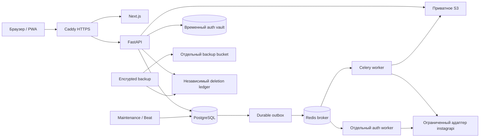

# Архитектура V1

## Компоненты и границы

Python 3.14, FastAPI, Pydantic, SQLAlchemy, psycopg, Alembic; PostgreSQL 18. Celery разделяет авторизацию, обработку и обслуживание. Next.js App Router и TypeScript: отдельный frontend, один репозиторий. Внешнее I/O не удерживает транзакцию БД при отправке писем и публикации в broker. HTTP DB I/O выполняется через AsyncSession/psycopg.AsyncConnection; общие ORM-функции используют штатный run_sync SQLAlchemy. Redis в HTTP асинхронный, блокирующие SDK/файлы/Argon2 вынесены из event loop. Workers сохраняют синхронные транзакции. Подробности: [ASYNC.md](ASYNC.md).

### Хранение и анализ

Snapshot неизменяемый: источник, режим идентичности, время наблюдения, полнота, checksum, provenance, число записей и размер нормализованных данных. Member хранит отношение и идентификатор. Архивы без стабильного ID используют нормализованный username; регистр отображения сохраняется. Режимы идентичности не смешиваются в достоверном сравнении. Разница — SQL anti-join, пагинация подписанными курсорами, пакетная запись событий. Автосравнения связывают соседние наблюдения; поздний импорт и удаление промежуточного снимка пересчитывают соседство.

Для списка используются поиск, категория, snapshot, избранное, наличие заметки и сортировка. Ответ содержит максимум 100 строк, по умолчанию 50. Курсор связан с владельцем, фильтром и снимком. Обзор использует сохранённые агрегаты, а не загружает все Member в память. Диапазон графика ограничен 1000 наблюдениями.

### Согласованность задач

Job — общая таблица для connect/sync/import/comparison/export. Детали типа доступны через отдельные API; Comparison и ExportJob содержат результат. Задание сначала фиксируется с Outbox в PostgreSQL, затем отправляется в Redis. Задержанная доставка, heartbeat и stale recovery имеют ограниченные повторы. Технические задачи допускают до трёх попыток. Повторный login и живой сбор автоматически не повторяются при ограничениях Instagram.

Идемпотентность команд: владелец, метод, путь, ключ и входные данные, срок 24 часа. Пароли и коды не хешируются для этой функции и не записываются в idempotency payload. Порядок блокировок: User → Profile → Job. Публикация проверяет run token, поколение профиля, статус владельца и паузу. Отключение повышает generation и отменяет активную работу; старый worker не публикует результат.

### Instagram

Зафиксирован instagrapi 3.0.20. Дополнительная транспортная граница проверяет разрешённые методы и адреса, собственный ID, таймауты, отсутствие redirect и скрытых повторов, интервал и общий бюджет. Для восстановления сессии не используется сохранённый пароль. Для живого сбора разрешены только сведения и списки собственного аккаунта. Login и 2FA проходят в отдельном worker; временные credentials зашифрованы, срок 10 минут.

Rolling лимит связан с HMAC внешнего ID и переживает отключение и повторное подключение. По умолчанию: автоматическое обновление раз в 24 часа, минимум 6 часов между попытками, максимум 2 в сутки, 100 запросов с интервалом 2 секунды. Challenge/429/частичная выдача прекращают обработку; неполный снимок не публикуется. Эти меры не гарантируют отсутствие блокировки.

### Приватность

API работает ролью insta_api, worker — insta_worker, миграции и операторские команды — владельцем схемы. API не читает Instagram secrets и не назначает роли. API не получает worker key/owner URL/SMTP credentials через Compose. MFA операторов: TOTP с защитой от повторения, одноразовые recovery codes и ограниченный срок привилегированной сессии. Операторский интерфейс показывает метаданные и поддержку, а не приватные списки.

Удаление сначала пишет независимый шифрованный ledger, немедленно запрещает доступ и отзывает сессии. Очистка повторяется maintenance. FileObject регистрируется до внешней записи; срок writing_until ограждает удаление от позднего завершения upload. S3 multipart ограничен 8 MiB на часть, незавершённые части отменяются. Экспорт проверяет владельца перед каждым скачиванием и во время передачи. CSV нейтрализует формулы.

Backup шифруется потоковым AES-GCM с проверкой последовательности, конца и целостности. Сессии, временные credentials, MFA secrets, outbox и временные экспорты не возвращаются. Restore допустим только в пустую БД; сначала ledger и санитизация, затем выдача доступа. Instagram требует нового подключения; оператору нужно переоформить MFA.

### Frontend / PWA

React Query хранит приватные данные только в памяти. Выход/удаление очищает клиентское состояние. Service worker сохраняет публичную офлайн-заглушку и значки, а не API или кабинет. Формы имеют labels, live statuses и диалоги с управлением focus. CSS предусматривает 320 px, safe areas, touch targets и reduced motion. Фактическая browser QA указана в STATUS отдельно.

## Решения относительно первоначального ТЗ

- psycopg и синхронный SQLAlchemy: простые транзакционные границы; I/O вне async paths.
- Собственный CSS и Lucide вместо дополнительного UI framework: единая визуальная система без новых зависимостей.
- Общая Job вместо отдельных таблиц каждого конвейера: один механизм recovery и отмены.
- Filesystem только в dev; приватный S3 обязателен в prod. /work — отдельный scratch volume для больших временных файлов.
- Квота считает нормализованные снимки и заметки; физический размер PostgreSQL и backups контролируется инфраструктурой отдельно.
- TypeScript 5.9.3: совместимость с typescript-eslint 8.71.1 и openapi-typescript 7.13.0. Python dependencies требуют 3.14; pydantic 2.13.5 соответствует ограничению instagrapi <2.14. Версии зафиксированы в lock-файлах.
- Официальная Meta интеграция и HTML-import относятся к V1.1, биллинг/команды к V2; они не выдаются за готовые функции V1.

Подробные решения: [ADR](adr/001-v1-decisions.md). Контракт: [OpenAPI](api/openapi.json).

UI: Tailwind theme/utilities + предметные CSS, общий Radix Dialog, RHF/Zod в auth/settings. [UI.md](UI.md).
