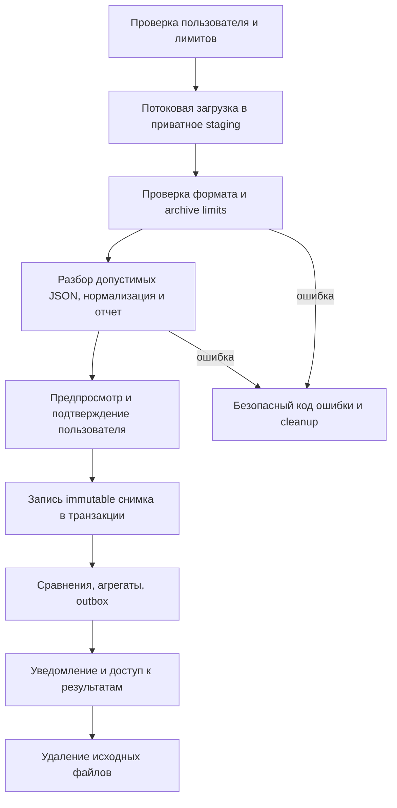

# Техническое задание на разработку InstaSurveillance

**Версия:** 2.1 · **Дата:** 07.10.2026 · **Статус:** проект для согласования заказчиком.

**Решение заказчика:** автоматический сбор через неофициальную библиотеку `instagrapi` выбран явно. Повторное согласование выбора источника не требуется. Остальные предложенные параметры подлежат обычной приемке ТЗ.

**Формат продукта:** публичный адаптивный веб-сервис и устанавливаемая PWA. Backend и frontend находятся в одном репозитории, собираются в отдельные Docker-образы. Backend — Python.

**Что согласуется:** пользовательские сценарии, состав первой версии, способ получения данных, экраны и визуальная концепция, архитектура, API, хранение данных, эксплуатация и критерии приемки. Указанные ниже решения и значения по умолчанию являются предложением исполнителя; требования пользователя отмечены отдельно. Согласование документа не означает обещания возможностей, которых нет у источника данных.

## Содержание

1. Резюме для заказчика и ключевое ограничение Instagram
2. Требования заказчика и принятые продуктовые решения
3. Исследование источников данных и внешних API
4. Границы первой версии и дальнейшее развитие
5. Роли и пользовательские сценарии
6. Правила вычислений и достоверность результатов
7. Карта страниц и подробное описание интерфейса
8. Визуальная концепция и адаптивность от 320px
9. PWA и работа без сети
10. Архитектура и конкретный технологический стек
11. Организация репозитория и правила разработки
12. Модель данных и целостность истории
13. Внутренний HTTP API и контракты
14. Импорт, автоматический сбор, фоновые задачи и восстановление после сбоев
15. Авторизация, безопасность и приватность
16. Хранение, экспорт, удаление и резервное копирование
17. Docker, конфигурация и развертывание
18. Производительность, надежность и наблюдаемость
19. Проверки и критерии приемки
20. План работ, результаты этапов и ответственность
21. Решения для согласования и риски
22. Источники и статус исследования

---

## 1. Резюме для заказчика

### 1.1 Что получит пользователь

Пользователь подключает собственный Instagram-аккаунт; сервис собирает доступные списки по расписанию и показывает:

- кто подписан на него и на кого подписан он;
- взаимные подписки;
- кого он читает без подписки в ответ;
- кто читает его без его подписки в ответ;
- какие аккаунты появились или исчезли между двумя загрузками;
- как менялись размеры списков за выбранный период;
- историю снимков, поиск по аккаунтам, фильтры, личные пометки и экспорт.

Интерфейс объясняет, на какую дату актуальны данные. Он показывает результаты периодического сбора, а не непрерывное наблюдение Instagram. Архив остается резервным источником.

### 1.2 Согласованный способ получения данных

**Основной источник V1 — `instagrapi`, выбранный заказчиком.** Пользователь вводит Instagram username и пароль в защищенной форме нашего сервиса, проходит поддерживаемую двухфакторную проверку при необходимости. Backend создает соединение, сохраняет зашифрованную сессию и в дальнейшем использует ее для периодического чтения подписчиков и подписок.

Пароль нужен только для конкретной попытки подключения/переподключения. Его не хранить постоянно. Если сессия перестала работать, пользователь вводит данные снова; скрытого бесконечного входа по сохраненному паролю нет.

Получение полных списков через официальный API не подтверждено; поэтому выбранная библиотека использует неофициальный доступ. Официальный OAuth может быть добавлен позднее для поддерживаемых полей профессионального аккаунта. [Описание Instagram Login, Meta](https://www.postman.com/meta/instagram/folder/6raa77c/instagram-api-with-instagram-login).

**Обновление по умолчанию — один запуск в 24 часа при активном подключении.** Ручной запуск подчиняется тем же ограничениям; первые данные собираются после успешного подключения. Наличие работающей сессии, полнота ответов и отсутствие ограничений Instagram определяют, можно ли завершить сбор. Интервал 24 часа — стартовая продуктовая настройка, а не гарантированно безопасный лимит Instagram.

Импорт официального пользовательского архива JSON/ZIP сохраняется как резервный способ, если автоматическое подключение недоступно или пользователь предпочитает не передавать данные входа.

### 1.3 Пример результата

Сервис завершает полный сбор A, затем очередной сбор B. Пользователь видит текущее соотношение списков из B и изменения между A и B. Исчезновение называется возможной отпиской: причина может быть связана с деактивацией, удалением аккаунта или неполнотой источника. Внешний устойчивый ID позволяет отличать переименование от ухода, когда ID доступен. Точное время события неизвестно.

### 1.4 Как уменьшаются риски

Доступ ограничен чтением собственных списков; сервис не выполняет подписки, отписки, публикации, сообщения или реакции. Он переиспользует сессию, ограничивает частоту и число запросов, исключает параллельный сбор одного аккаунта и останавливается при ограничениях/проверке безопасности.

Использование неофициального API может противоречить правилам Instagram; блокировка, проверка входа или прекращение работы endpoint остаются возможными. Перед подключением пользователь видит краткое объяснение и явное подтверждение выбранного способа. Сервис не обещает отсутствие блокировок и не обходит CAPTCHA, challenge или ограничение платформы.

## 2. Требования заказчика и продуктовые решения

### 2.1 Подтвержденные требования

| Код | Требование заказчика | Как выполняется |
|---|---|---|
| Z-01 | Backend и frontend в одном проекте | Монорепозиторий с независимыми приложениями |
| Z-02 | Python на backend | FastAPI, Python и Poetry |
| Z-03 | Несколько пользователей, каждый со своим аккаунтом | Изоляция данных по пользователю; один Instagram-профиль по умолчанию |
| Z-04 | Отписки и оба вида невзаимных подписок | Сравнение снимков и операций над множествами |
| Z-05 | Минимизировать риски при выбранном автоматическом сборе | Чтение через instagrapi, ограниченные запросы, шифрование сессии и остановка при ограничениях |
| Z-06 | Изучить библиотеку из tgplanner и альтернативы | Анализ выполнен, выводы в разделе 3 |
| Z-07 | Адаптивный сайт и PWA от 320px | Отдельные мобильные компоновки, manifest, offline-экран |
| Z-08 | Публичный облачный сервис | TLS, production Compose, резервное копирование и мониторинг |
| Z-09 | Отдельные Docker для backend и frontend | Два Dockerfile; worker использует образ backend |
| Z-10 | Раздельные окружения local/dev и production | Самостоятельные Compose-файлы и отдельные volumes/секреты |
| Z-11 | Все необходимые настройки через .env | Валидация env, безопасные примеры, runtime-конфигурация |
| Z-12 | Не сохранять кэш в проекте | Временные данные и кэши вне рабочего дерева; правила раздела 17 |
| Z-13 | Хранить историю для аналитики | Долгосрочные нормализованные снимки и воспроизводимые сравнения |
| Z-14 | Возможность улучшать продукт | Модульная архитектура, адаптеры источников, версии API и парсеров |
| Z-15 | Красивый, стильный, молодежный интерфейс | Конкретная дизайн-концепция в разделе 8 |

### 2.2 Предлагаемые значения по умолчанию

- Рабочее название: **InstaSurveillance**. Название и логотип заменяемы.
- Язык первого выпуска: русский. Все UI-тексты подготовлены к последующей локализации.
- Вход в сервис: email и пароль; Instagram-подключение и вход в наш сервис — разные операции.
- Один Instagram-профиль на пользователя; ограничение настраивается, модель позволяет несколько.
- Первый выпуск без платежей и тарифов. Ограничения ресурсов действуют и в бесплатном продукте.
- Основной источник списков: автоматический сбор через `instagrapi`; резервный — JSON/ZIP экспорт. HTML-экспорт — следующая версия парсера.
- По расписанию один сбор в 24 часа, ручной — не чаще одного в 6 часов и не более двух начал сбора в скользящие 24 часа; адаптер платформы может требовать более редких запусков. Настройки не считаются безопасными лимитами Instagram.
- История нормализованных данных хранится до удаления пользователем/закрытия аккаунта, при допустимости такого хранения.
- Приватный кабинет не индексируется поисковиками и не содержит рекламных трекеров.
- Первоначальная нагрузка для проектирования: до 1 000 зарегистрированных пользователей, 100 одновременных активных пользователей и до 100 000 уникальных записей суммарно в подписчиках и подписках одного снимка. Это проектные ориентиры, а не подтвержденный прогноз аудитории.

## 3. Источники данных и внешние API

### 3.1 Что найдено в tgplanner

Проверены `backend/pyproject.toml` и `backend/app/instagram/private_client.py` в проекте `/Users/zidansaparbegov/PyCharmMiscProject/tgplanner`.

В зависимостях указана **instagrapi**, а адаптер прямо описан как клиент приватного/mobile API. Авторизация вызывает `client.login(username, password)` и обрабатывает двухфакторную проверку. Код создания промежуточного состояния 2FA включает пароль; перенос такого состояния в новый проект требует самостоятельного анализа хранения и удаления. Это наблюдение о коде, а не утверждение о фактическом хранении паролей в production.

Разработчик библиотеки сам называет ее неофициальной оберткой. Следовательно, эта интеграция не является официальным OAuth API Meta и не дает гарантии отсутствия блокировок. [Документация instagrapi](https://subzeroid.github.io/instagrapi/).

### 3.2 Сравнение способов

| Способ | Тип доступа | Полные поименные списки | Автоматическое обновление | Решение для проекта |
|---|---|---|---|---|
| Пользовательский экспорт Instagram | Файл, полученный самим пользователем | Если экспорт содержит нужные категории полностью | После нового импорта пользователя | Резервный сценарий V1 |
| Instagram API with Instagram Login | Официальный OAuth для Business/Creator | Поддерживаемый способ получения всех списков не подтвержден | Для документированных полей и метрик | Дополнение V1.1; не обещать поименный мониторинг |
| Instagram API with Facebook Login | Официальный API, профессиональный аккаунт и связанная Page | Поддерживаемый способ получения всех списков не подтвержден | Для документированных ресурсов | Не использовать в базовой версии: лишняя связка Facebook Page |
| instagrapi | Неофициальный приватный/mobile API | Библиотека содержит методы followers/following | Возможно при работающей сессии и полном ответе; риск ограничений остается | Основной источник V1 по выбору заказчика |
| Скрейпинг веб-интерфейса или сторонний сборщик | Неофициальный источник | Возможности/полнота зависят от реализации | Зависит от источника | Не является основанием для обещаний V1 |

Требование профессионального аккаунта без обязательной Facebook Page для Instagram Login подтверждается [официальной коллекцией Meta](https://www.postman.com/meta/instagram/folder/6raa77c/instagram-api-with-instagram-login). Вариант Facebook Login требует связанной Page и не предоставляет доступ к обычным consumer-аккаунтам. [Официальная документация коллекции, раздел Facebook Login](https://www.postman.com/meta/workspace/instagram/documentation/23987686-9386f468-7714-490f-9bfc-9442db5c8f00).

Наличие методов списков в instagrapi подтверждено документацией автора, но это не меняет статус источника на официальный. [Методы работы с пользователями](https://subzeroid.github.io/instagrapi/latest/usage-guide/user/).

### 3.3 Необходимые интеграции V1

| Интеграция | Назначение | Минимальные данные | Требования |
|---|---|---|---|
| `instagrapi` | Подключение, 2FA и чтение собственных списков | Сессия, внешний ID, отношения подписки | Только worker, шифрование, лимиты и контролируемый pause |
| Парсер Instagram JSON/ZIP | Резервное получение списков | Username/ID при наличии, отношения и метаданные | Версии парсера, подтверждение полноты |
| SMTP | Подтверждение email, восстановление, сервисные уведомления | Email и служебные параметры | TLS; локально Mailpit |
| S3-совместимое хранилище | Временные импорты и экспорты | Приватные файлы с TTL | MinIO локально; приватный bucket production |
| Метрики/ошибки | Эксплуатация | Обезличенные ошибки, длительности | Без credentials, списков и архивов |

Адаптер `InstagramPrivateProvider` инкапсулирует библиотеку и исключения. API-приложение не запускает синхронный клиент библиотеки в event loop. Версия фиксируется после проверки Python/transport dependencies; приватные ответы не считаются стабильным контрактом.

Используемые операции: `Client.login` с поддерживаемым verification flow; сохранение/восстановление settings через allowlist; получение собственного ID и минимальных метаданных; чтение followers/following с контролем страниц. Документация содержит потоковые итераторы и методы списков, но их работоспособность/полнота проверяются на закрепленной версии. [Методы списков](https://subzeroid.github.io/instagrapi/latest/usage-guide/user/), [сессии и вход](https://subzeroid.github.io/instagrapi/latest/usage-guide/interactions/).

Не пользоваться высокоуровневым методом, если он скрывает неконтролируемые retries, переключение источников или обрезку списка. Нужен адаптер, который считает все попытки, проверяет cursor и сохраняет признаки полноты. Точный метод pagination закрепляется после проверки версии, без копирования приватных URL в domain.

Meta app/OAuth credentials не требуются для `instagrapi` V1. Подключение не называется официальным Instagram Login. Контекст `tgplanner` применяется как исходный пример, а не копируется вместе с обработкой secrets.

### 3.4 План официального расширения V1.1

Реализуется отдельно от базовой аналитики, после приемки конкретных endpoint/permission на тестовом профессиональном аккаунте:

| Операция | Предполагаемый официальный ресурс | Условие включения |
|---|---|---|
| Авторизация Instagram Login | OAuth authorize и code exchange, указанные текущей документацией Meta | Подтверждены redirect URI, permissions и App Review |
| Данные собственного профиля | `GET graph.instagram.com/{version}/{ig_user_id}` с поддерживаемыми fields | Выбранная версия действительно поддерживает fields |
| Счетчики и агрегаты | Документированные поля профиля и/или `/{ig_user_id}/insights` | Подтверждены конкретные метрики, scopes и тип аккаунта |
| Продление токена | Документированный exchange/refresh flow | Проверены сроки, ограничения и отзыв |
| Отключение/удаление разрешений | Поддерживаемый revoke flow и требуемые callbacks | Соответствует текущему продукту Meta |

Список конкретных fields/метрик и точные URL OAuth фиксируются в `docs/integrations/meta.md` по доступной документации и проверенному ответу тестового аккаунта. Это контракт отдельного расширения, а не незакрытый выбор архитектуры V1. Не запрашивать публикацию, сообщения или комментарии ради аналитики подписок. Не придумывать endpoint `followers` по аналогии с другими API.

Прямой HTTP-клиент — HTTPX за интерфейсом провайдера. Отдельный сторонний SDK включается только если дает проверенную пользу и обслуживает документированный официальный API.

### 3.5 Пределы проведенного исследования

Во время проверки часть страниц `developers.facebook.com` отвечала HTTP 429 или требовала входа. Для описания типов аккаунтов и OAuth-продуктов использована официальная коллекция Meta в Postman. Проверка реальных разрешений, полей и полного App Review без приложения и тестового аккаунта не выполнялась.

Вывод об отсутствии подтвержденного официального способа получить полные списки — ограниченный результат исследования, а не обещание, что Meta никогда не добавит такой способ. Архитектура позволяет добавить его отдельным провайдером.

## 4. Состав первой версии и развитие

### 4.1 Обязательная поставка V1

| Код | Функция | Состав |
|---|---|---|
| F-01 | Аккаунт сервиса | Регистрация, email-подтверждение, вход, восстановление, сессии |
| F-02 | Подключение Instagram | Login, 2FA, encrypted session, переподключение, pause и отключение |
| F-03 | Получение снимков | Сбор по расписанию/вручную через instagrapi; резервный ZIP/JSON импорт |
| F-04 | Обзор | Счетчики, взаимность, последние изменения, актуальность |
| F-05 | Списки | Подписчики, подписки, взаимные и оба типа невзаимности |
| F-06 | Изменения | Появившиеся/исчезнувшие записи, сравнение произвольных снимков |
| F-07 | Поиск и фильтры | Username, категория, период, пометки; сохранение фильтра в URL |
| F-08 | История | Снимки, их статус, сравнение, удаление с пересчетом |
| F-09 | Аналитика | Графики размера списков, прирост, доля взаимности |
| F-10 | Личные пометки | «Избранное» и текстовая заметка к записи, только для владельца |
| F-11 | Уведомления | Результат сбора/импорта, значимые изменения и необходимость переподключения; email по настройке |
| F-12 | Экспорт | CSV списка/сравнения и JSON собственных данных |
| F-13 | Приватность | Удаление снимка, профиля, истории и учетной записи |
| F-14 | PWA | Установка, статическая оболочка, экран отсутствия сети |
| F-15 | Поддержка и эксплуатация | Справка, обращение, техническая админка без свободного просмотра списков |

### 4.2 В последующих версиях

- V1.1: официальное подключение Business/Creator и подтвержденные агрегированные метрики.
- V1.2: английская локализация, дополнительные форматы экспорта и расширенные пользовательские отчеты.
- V2: несколько профилей на пользователя, платные планы, push-уведомления, команды — по отдельным требованиям.

### 4.3 Зафиксированные границы

V1 не обещает точное время отписки, обнаружение блокировок, «тайных зрителей», посетителей профиля, причин ухода или событий до первого снимка. Фото, имя, верификация и другие атрибуты показываются только если присутствуют в разрешенном источнике; иначе используются username и локальная монограмма. Запрос к Instagram ради дополнения аватарок не выполняется.

Массовые подписки/отписки, публикация, сообщения, лайки, AI-прогнозы поведения людей и продажа пользовательских списков не входят в согласуемый объем. При необходимости они требуют отдельной продуктовой постановки и оценки источника.

## 5. Роли и пользовательские сценарии

### 5.1 Роли

| Роль | Доступ |
|---|---|
| Гость | Лендинг, демонстрация на синтетических данных, справка, вход/регистрация, юридические страницы |
| Неподтвержденный пользователь | Подтверждение email, повтор письма, выход; импорт запрещен |
| Пользователь | Только собственные профили, снимки, заметки, настройки, экспорт и удаление |
| Оператор поддержки | Технические статусы задач и обращения, без просмотра полных списков и файлов |
| Администратор | Управление доступом и глобальными лимитами, технические ошибки, аудит; MFA обязательна |

В первом выпуске операторские роли могут принадлежать одному человеку, но права и проверки остаются раздельными. Публичного endpoint повышения своей роли нет.

### 5.2 Сценарий A: первый запуск

1. Гость видит ценность, частоту обновления и краткое объяснение неофициального подключения.
2. Регистрируется, подтверждает email, входит.
3. Выбирает «Подключить Instagram» или резервный «Загрузить архив».
4. В основном сценарии подтверждает условия подключения, вводит username и пароль; сведения передаются только по HTTPS.
5. Backend запускает одноразовую login-задачу. При поддерживаемой 2FA пользователь сам вводит код; секрет TOTP/доступ к SMS/email не запрашиваются.
6. При challenge сервис ставит процесс на паузу и направляет пользователя завершить проверку в официальном Instagram. Автоматического обхода проверки нет.
7. После успешного входа сервер определяет собственный внешний ID из авторизованной сессии, а не собирает произвольный username.
8. Сессия шифруется, временные credentials удаляются; начинается первый сбор.
9. После полного сбора пользователь видит текущую взаимность. Исторические отписки доступны только после следующего сопоставимого снимка.

Резервный сценарий архива: выбрать свой профиль и JSON-экспорт полного периода, загрузить ZIP/нужные JSON, проверить категории/время, подтвердить право обработки и полноту. Архив не доказывает владение аккаунтом.

### 5.3 Сценарий B: обновление данных

1. Scheduler создает задачу по расписанию; пользователь также может нажать «Обновить данные» в рамках лимитов.
2. Worker восстанавливает сохраненную сессию без нового login и последовательно получает собственные followers/following.
3. Полный валидированный результат публикуется как новый снимок; после частичного/ошибочного ответа прошлый снимок остается актуальной доступной историей с прежней датой.
4. При существенном необъясненном расхождении счетчиков/объема результат получает `needs_review`, исчезновения не публикуются.
5. Сервис рассчитывает изменения и уведомляет пользователя по настройкам.
6. При ограничении/проверке доступа задача останавливается, статус профиля меняется, UI показывает следующую допустимую попытку либо необходимость переподключения.
7. В резервном сценарии пользователь загружает новый архив; повтор уже принятого набора в ту же дату не создает дубликат.

### 5.4 Сценарий C: просмотр невзаимных подписок

Пользователь выбирает «Я подписан без ответа» либо «На меня подписаны без ответа». Список показывает username, локальную монограмму, категорию и пометку. Можно искать, добавить заметку, экспортировать и открыть профиль в Instagram новой вкладкой. Кнопок автоматической отписки нет.

### 5.5 Сценарий D: история

Пользователь выбирает два совместимых снимка. Более старый архив, загруженный позднее, попадает в хронологию по времени наблюдения, а не становится автоматически самым свежим. Если время создания неизвестно, оно указывается пользователем и отображается как заявленное.

### 5.6 Сценарий E: удаление

Пользователь выбирает снимок/профиль/весь аккаунт, видит объем удаления, подтверждает действие, при удалении аккаунта повторно вводит пароль. Доступ к удаляемым данным прекращается сразу; очистка рабочих хранилищ завершается в течение 24 часов. Интерфейс показывает статус и сообщает о сроке исчезновения из ротационных backup.

### 5.7 Сценарий F: ошибка

Сервис сохраняет предыдущую историю при ошибке сбора/импорта. Ошибка содержит понятное действие: дождаться допустимого времени, завершить проверку в Instagram, переподключиться, использовать резервный архив или обратиться в поддержку по номеру запроса. Содержимое внутренних исключений и секреты пользователю не показываются.

## 6. Правила анализа и достоверность

### 6.1 Формулы

Пусть `F(S)` — множество подписчиков снимка S, `G(S)` — множество подписок того же снимка:

| Категория | Формула |
|---|---|
| Взаимные | `F(S) ∩ G(S)` |
| Я подписан без ответа | `G(S) − F(S)` |
| На меня подписаны без ответа | `F(S) − G(S)` |
| Появились среди подписчиков | `F(B) − F(A)` |
| Исчезли среди подписчиков | `F(A) − F(B)` |
| Появились среди моих подписок | `G(B) − G(A)` |
| Исчезли среди моих подписок | `G(A) − G(B)` |
| Изменение размера подписчиков | `|F(B)| − |F(A)|` |
| Доля подписчиков с взаимностью | `|F(S) ∩ G(S)| / |F(S)| × 100%` |

Если знаменатель равен нулю, доля показывается как «Нет данных для расчета», а не NaN. Нетто-прирост равен разнице размеров множеств, но не является точным количеством всех подписок/отписок внутри периода: аккаунт мог уходить и возвращаться между снимками.

### 6.2 Идентификация аккаунтов

Устойчивый внешний ID предпочтителен, если присутствует в источнике. Если его нет, ключом является нормализованный username: удалить один начальный `@`, пробелы по краям, привести регистр; не менять точки и подчеркивания. Исходное значение хранится для отображения. Некорректные значения отклоняются с отчетом, а не молча превращаются в другой аккаунт.

Сравнение по username имеет ограничение: переименование может выглядеть как исчезновение и появление. Не объединять профили автоматически по похожему имени, фотографии или эвристике. Заметка привязывается к доступному ключу, и при возможном переименовании не переносится без основания.

### 6.3 Полнота и время

Для каждого снимка сохраняются отдельно:

- полнота каждой категории: `unknown`, `partial`, `user_confirmed`, `collection_validated`;
- способ сопоставления: `stable_id` или `username`;
- время загрузки `imported_at`;
- заявленное время наблюдения `observed_at` и его происхождение;
- источник, версия библиотеки/формата, парсера и алгоритма; для live-сбора — начало/конец сбора, ожидаемые счетчики, число страниц и причина завершения pagination.

Отсутствие файла подписчиков не равно пустому списку. Пустой валидный файл требует явного подтверждения нулевого результата. Если категории собраны в разное время, взаимность не маркируется как актуальный единый снимок без объяснения.

Архив может состоять из нескольких `followers_*.json`: отсутствие части нельзя всегда определить по самим файлам. UI не должен утверждать, что полнота доказана технически. Для локального экспорта без манифеста полнота — подтверждение пользователя, и это видно в результатах.

### 6.4 Правила публикации изменений

Live-снимок получает `collection_validated` только после завершения pagination обеих категорий без ошибок, дублей cursor, превышения бюджета и выявленных расхождений счетчиков. Это проверка полученного набора, а не независимое доказательство полноты ответа Instagram. Списки собираются последовательно и не являются атомарным снимком платформы: сохраняется весь интервал сбора. Если счетчики/списки менялись в процессе, данные помечаются как несогласованные; не повторять обход бесконечно ради совпадения.

- Для проверенного live-сбора автоматическое сравнение разрешено с обозначением времени и источника; частичный ответ не заменяет полный снимок.

- Сопоставлять только один и тот же профиль и одинаковые типы списков.
- Для заявленных полных архивов разрешено сравнение с отметкой «по подтвержденным пользователем данным».
- Для неполного/неизвестного списка исчезновения не рассчитываются как отписки; сравнение блокируется или показывается только как технический предпросмотр без событий.
- Для сравнения по username показывать «Исчезли из списка — возможные отписки» и пояснение причины неопределенности.
- Сохранять интервал `(observed_at A, observed_at B]`; не выдумывать дату события.
- Первый снимок не создает исторические отписки и не рассылает уведомление «все подписчики новые».
- График соединяет точки снимков, но не интерполирует количество людей как наблюдавшиеся ежедневные данные. На пустых датах — нет наблюдения.
- Удаление или вставка старого снимка пересчитывает соседние сравнения; пометки пользователя сохраняются отдельно.

### 6.5 Контрольный пример для приемки

Снимок A: `F={anna, boris, dasha}`, `G={anna, kirill}`. Снимок B: `F={anna, dasha, elena}`, `G={anna, dasha, kirill}`.

Результат B: взаимные `{anna, dasha}`, «я без ответа» `{kirill}`, «на меня без ответа» `{elena}`. Между A и B среди подписчиков появился `elena`, исчез `boris`, нетто-прирост 0. Появление/исчезновение не доказывает точное время или причину события.

## 7. Карта страниц и интерфейс

### 7.1 Маршруты

| URL | Экран | Основное действие |
|---|---|---|
| `/` | Лендинг | «Начать анализ» |
| `/demo` | Демо на синтетических данных | «Создать аккаунт» |
| `/login`, `/register` | Вход и регистрация | Войти/зарегистрироваться |
| `/verify-email`, `/forgot-password`, `/reset-password` | Доступ | Подтвердить/восстановить |
| `/app/onboarding` | Первичная настройка | Подключить Instagram или выбрать архив |
| `/app/instagram/connect` | Подключение/2FA | Войти, подтвердить код или переподключиться |
| `/app/syncs/{id}` | Состояние сбора | Прогресс, полнота, ошибка и допустимое действие |
| `/app` | Обзор | Обновить данные |
| `/app/people` | Все категории отношений | Выбрать категорию и найти аккаунт |
| `/app/changes` | Изменения | Выбрать период/снимки |
| `/app/history` | История снимков | Сравнить/удалить |
| `/app/analytics` | Аналитика | Выбрать период |
| `/app/imports/new`, `/app/imports/{id}` | Загрузка и статус | Проверить/подтвердить |
| `/app/notifications` | Уведомления | Прочитать/настроить |
| `/app/settings` | Настройки | Профиль, сессии, приватность |
| `/help`, `/help/import` | Справка | Инструкция и обращение |
| `/privacy`, `/terms` | Юридические страницы | Прочитать условия |
| `/admin` | Техническое администрирование | Просмотр статусов и ошибок |

Роутинг кабинета закрыт для гостей, но окончательную проверку выполняет backend. Переход после истечения сессии сохраняет безопасный внутренний маршрут возврата. Внешний `return_to` запрещен.

### 7.2 Лендинг

Первый экран: компактный логотип, вход, заголовок «Разберись в своих подписках», пояснение про автоматический сбор и неофициальное подключение, CTA «Начать анализ» и «Посмотреть демо». Справа на desktop — стилизованный пример интерфейса с синтетическими данными; на mobile — ниже текста.

Далее: три карточки пользы, три шага подключения, блок приватности, FAQ и footer. В FAQ объяснить: зачем пароль при входе и почему он не хранится постоянно, как используется сессия, когда обновляются данные, что делать при challenge/2FA и чем резервный архив отличается от автоматического сбора. Не использовать обещания «без блокировок навсегда» и «мониторинг в реальном времени».

### 7.3 Обзор

Порядок сверху вниз:

1. Профиль, дата снимка, источник/полнота, состояние подключения, следующая проверка и кнопка «Обновить данные». При лимите кнопка показывает допустимое время; при challenge — «Переподключить» с инструкцией.
2. Карточки количества подписчиков, подписок, взаимных и исчезнувших между последними снимками.
3. Две карточки невзаимных отношений с понятными названиями и ссылкой на список.
4. График истории размеров списков.
5. Последние изменения и краткая карточка последнего импорта.

При одном снимке карточка изменений показывает дату следующего запланированного сбора либо предлагает резервный импорт. При отсутствии данных — onboarding. При неполных данных — статус и список доступных вычислений; недоступная метрика отображает причину, а не ноль.

### 7.4 Списки людей

Категории оформлены переключателем: «Подписчики», «Мои подписки», «Взаимные», «Я без ответа», «На меня без ответа». Под переключателем — поиск и кнопка фильтров. Количество совпадений показывается отдельно от полного размера категории.

Desktop-строка: монограмма, username, категория, пометка, действие «Открыть Instagram», меню заметки. Mobile-строка: username и статус в две строки, небольшое меню; действия не сжимают текст до нечитаемого вида. Полный username доступен в деталях записи.

Фильтры: категория, избранное, наличие заметки; сортировка по username и по первому наблюдению только если такая дата есть в нашей истории. Отсутствующее поле не сортируется выдуманным значением. Поиск с задержкой 300 мс, URL-параметры сохраняют состояние и переход назад. Порция по умолчанию 50 записей, максимум 100; кнопка «Показать еще», без рендера тысяч строк одновременно.

### 7.5 Изменения

Вверху два выбранных снимка или выбор периода с фактическими крайними снимками. Далее сводка: появились/исчезли среди подписчиков и среди подписок. Список событий показывает username, вид изменения, интервал наблюдения и ограничение идентификации.

Запрос «за 7 дней» не подменяется произвольным снимком вне периода: интерфейс показывает, какие снимки доступны, либо предлагает выбрать ближайшие вручную. Если сравнение неполно, сообщение объясняет причину и не отображает недостоверное число отписок.

### 7.6 История

Список снимков: интервал live-сбора либо заявленное время архива, время сохранения, размеры категорий, источник/полнота, статус. Действия: детали, сравнить, удалить. В деталях — checksum набора, версия парсера, предупреждения, список принятых/отклоненных файлов без содержимого приватных данных.

Удаление сопровождается предупреждением о пересчете истории. Во время пересчета сравнения помечены как устаревшие и не отправляют повторные уведомления.

### 7.7 Аналитика

Периоды: 7/30/90 дней, все время и собственный диапазон. Графики: число подписчиков/подписок, изменения между снимками, доля взаимности. Под графиком — даты реальных наблюдений, таблица данных и пояснение, если точек мало.

Сравнение периодов доступно только при достаточных снимках. Не рассчитывать демографию, вовлеченность или «ценность подписчика» по одним usernames.

### 7.8 Мастер импорта

Четыре шага: «Получите архив» → «Загрузите файлы» → «Проверьте данные» → «Результат».

Шаг загрузки поддерживает выбор файла на телефоне и drag-and-drop на desktop, показывает лимит и список выбранного. ZIP может включать посторонние категории: обрабатываются только разрешенные файлы связей, остальные игнорируются и не сохраняются после задачи.

Предпросмотр: профиль, даты, категории, счетчики, образец до 10 записей, предупреждения, обязательное подтверждение источника и полноты. Не пытаться автоматически доказывать владение Instagram аккаунтом по имени файла. Пользователь подтверждает право загружать эти данные.

Ошибки имеют конкретные тексты: «Не найдены файлы подписчиков», «Это HTML-экспорт, выберите JSON», «Найдена только часть списка», «Этот архив уже загружен», «Превышен лимит файла», «Формат архива пока не поддерживается».

### 7.9 Настройки

Разделы: email/пароль сервиса, Instagram-подключение (статус, расписание, пауза, переподключение, отключение), активные сессии сервиса, уведомления, тема, данные и приватность. Смена email требует подтверждения нового адреса; смена пароля отзывает остальные сессии. Экспорт/удаление выделены отдельными понятными действиями.

### 7.10 Уведомления и поддержка

Уведомления содержат тип события, дату, статус прочтения и ссылку на результат. Email о завершении сбора/импорта и необходимости переподключения включается пользователем; письма подтверждения/восстановления обязательны для соответствующего действия.

Обращение в поддержку содержит категорию, свободный текст и безопасный request ID. По умолчанию в обращение не прикладываются списки, архивы и токены. Страница справки предупреждает не отправлять пароли.

### 7.11 Техническая админка

Минимальный состав: пользователи и их состояние, число/статусы задач, сбои парсера, лимиты, обращения, аудит. Оператор не может открыть чужой архив или экспортировать чужие списки. Повтор задания допустим только технически безопасный; действие журналируется. Удаление/блокировка доступа требует права администратора.

### 7.12 Подключение Instagram, 2FA и состояния синхронизации

Экран подключения содержит username, пароль, краткое описание неофициального доступа и рисков, политику хранения сессии, отдельное подтверждение подключения и кнопку «Подключить». Ни пароль, ни код не сохраняются в browser persistent storage, URL, аналитике или frontend error tracker. После отправки поле очищается; при обновлении страницы требуется повторный ввод, если pending-попытка уже истекла.

Экран кода показывает только поддерживаемый метод и безопасную маску назначения, полученную из ответа источника. Пользователь сам вводит код из своего authenticator/SMS/email. Продукт не запрашивает TOTP seed, пароль от почты или доступ к SMS. Pending-попытка живет не более 10 минут; максимум 3 неверных кода, затем новая явная попытка после account login limit.

При challenge: «Instagram просит подтвердить вход. Откройте официальное приложение, завершите проверку и переподключите аккаунт». Не открывать встроенный небезопасный proxy-логин и не просить CAPTCHA/документы через наш сервис.

| Статус подключения | Что видит пользователь | Доступное действие |
|---|---|---|
| `disconnected` | Instagram не подключен | Подключить или использовать архив |
| `connecting` | Вход выполняется | Дождаться/отменить |
| `awaiting_2fa` | Требуется код | Ввести поддерживаемый код/отменить |
| `active` | Подключен; следующий сбор и дата данных | Обновить в рамках лимита, пауза, отключить |
| `syncing` | Сбор: подписчики/подписки, получено записей | Дождаться/кооперативно отменить |
| `paused_by_user` | Автообновление выключено | Возобновить при отсутствии platform-block |
| `cooldown` | Instagram ограничил запросы; next_allowed_at | Дождаться; архив доступен |
| `challenge_required` | Нужна проверка в Instagram | Завершить проверку там и явно переподключить |
| `reconnect_required` | Сессия не действует | Ввести учетные данные заново |
| `provider_unavailable` | Источник временно не работает | Дождаться/архив, без повторных login |
| `disabled` | Доступ отключен оператором/политикой | История доступна, новых запросов нет |

Состояния подключения, отдельного sync job и полноты снимка отображаются раздельно: активная сессия не означает успешный полный сбор. Расписание можно поставить на паузу; нельзя кнопкой «Возобновить» снять challenge, отозванную сессию или неистекший cooldown.

Уведомления по умолчанию внутри кабинета: новый результат, необходимость переподключения/проверки и остановка сбора. При нескольких сбоях одного типа уведомления дедуплицируются. Email об изменениях по opt-in содержит сводку и ссылку, без списка людей в теме/теле.

## 8. Визуальная концепция и адаптивность

### 8.1 Предлагаемый стиль

Основная тема — светлая с графитовыми текстами, ярким фиолетовым акцентом и небольшими лаймовыми декоративными элементами. Темная тема — полноценная альтернатива через дизайн-токены. Стиль: четкая сетка, крупные числа, округлые карточки, сдержанная анимация, без стилизации под официальный Instagram.

| Токен | Светлая тема | Назначение |
|---|---|---|
| `background` | `#F6F7FB` | Фон страницы |
| `surface` | `#FFFFFF` | Карточки и формы |
| `text-primary` | `#171A27` | Основной текст |
| `text-secondary` | `#5C6273` | Подписи |
| `accent` | `#6D28D9` | Основные кнопки и фокус |
| `accent-soft` | `#EDE9FE` | Выбранные элементы |
| `success` | `#166534` | Успех и подтверждение |
| `danger` | `#B91C1C` | Ошибки и удаление |
| `border` | `#D9DEEA` | Границы |

Темная тема использует фон `#11131B`, поверхность `#1B1E2A`, основной текст `#F5F6FA`; оттенки статусов подбираются с проверкой контраста. Это исходные значения для дизайна: окончательные сочетания проверяются на реальных компонентах.

Шрифт — локально поставляемый Inter с кириллицей, системный fallback. Основной текст 16px, подписи не меньше 12px, заголовки 24–40px по breakpoint. Радиусы карточек 16px, контролов 12px. Шаг сетки 4px, основные интервалы 8/12/16/24/32px. Иконки Lucide, текст всегда сопровождает неоднозначную иконку.

### 8.2 Схема desktop

```text
┌────────────────────┬──────────────────────────────────────────────────┐
│ InstaSurveillance  │ @myprofile  · сбор на 07.10    [Обновить данные]  │
│                    ├──────────────────────────────────────────────────┤
│ Обзор              │ Подписчики   Подписки   Взаимные   Изменения      │
│ Люди               │   1 240        830        612      между A и B    │
│ Изменения          ├─────────────────────────┬────────────────────────┤
│ История            │ Я без ответа: 218       │ На меня без ответа:628 │
│ Аналитика          ├─────────────────────────┴────────────────────────┤
│                    │ История размеров списков · реальные снимки      │
│ Уведомления        │ [                      график                 ] │
│ Настройки          ├──────────────────────────────────────────────────┤
│ Помощь             │ Последние изменения                  Все →      │
└────────────────────┴──────────────────────────────────────────────────┘
```

Числа в макете демонстрационные. Сайдбар 232px, рабочая область до 1200px, внешние отступы 24–32px.

### 8.3 Схема mobile, включая 320px

```text
┌──────────────────────────────┐
│ IS   @myprofile       [ ⋯ ]  │
│ Сбор на 07.10 · подключен       │
│ [ Обновить данные          ] │
├──────────────┬───────────────┤
│ Подписчики   │ Мои подписки  │
│ 1 240        │ 830           │
├──────────────┼───────────────┤
│ Взаимные     │ Изменения     │
│ 612          │ Между A и B   │
├──────────────┴───────────────┤
│ Я без ответа          218 →  │
│ На меня без ответа    628 →  │
│ Последние изменения          │
│ @username    Исчез из списка │
│ ...                          │
├──────────────────────────────┤
│ Обзор  Люди  История  Еще     │
└──────────────────────────────┘
```

### 8.4 Breakpoints и навигация

| Ширина | Компоновка |
|---|---|
| 320–479px | Отступы 12px; карточки 2×2 при сохранении читаемости; остальное в одну колонку |
| 480–767px | Отступы 16px; нижняя навигация; расширенные карточки |
| 768–1023px | Отступы 24px; компактный sidebar или раскрываемое меню |
| От 1024px | Полный sidebar, таблицы и многоколоночный обзор |

На mobile нижняя панель имеет четыре подписанных раздела: «Обзор», «Люди», «История», «Еще». «Еще» открывает аналитику, уведомления, настройки и помощь. Без дублирования важных действий в неудобных местах.

Фильтры открываются нижним sheet с прокручиваемым содержимым. Диалоги на узком экране становятся почти полноэкранными. Учесть `safe-area-inset-*`, экранную клавиатуру, высоту динамического viewport и перекрытие контента нижней навигацией.

### 8.5 UI-состояния и доступность

- Минимальная область нажатия — 44×44px; основные кнопки высотой 48px.
- Контраст основного текста не ниже 4.5:1; ошибки различаются текстом/иконкой, а не одним цветом.
- Поддержать клавиатуру, видимый фокус, labels, aria-live для статусов и правильный focus trap диалогов.
- Загрузка: skeleton; длительные операции: реальный этап, без выдуманного процента.
- Пустой результат поиска: сбросить фильтры; пустая история: подключить Instagram или загрузить архив.
- Сбой сети: повторить запрос; прошлые данные не маскировать как свежие.
- Учитывать `prefers-reduced-motion`, масштабирование текста до 200% и экранные дикторы.
- Анимация 150–200 мс; уважать уменьшение движения; не блокировать действия декоративной анимацией.
- Основные сценарии работают без горизонтальной прокрутки всей страницы на 320px. Графики имеют текстовую таблицу, длинные usernames раскрываются в деталях.

## 9. PWA и работа без сети

- Manifest: название, short name, `start_url`, scope, theme/background color, `display: standalone`, иконки 192/512 и maskable; favicon и Apple touch icon.
- Установка Android/desktop — через доступный браузерный prompt после осмысленного использования. Для iOS — краткая инструкция «Добавить на экран Домой», когда применимо.
- Service worker кэширует только версионированные публичные статические assets и специальный offline-экран.
- API, приватные документы, пользовательские списки, маршруты авторизации, импорты и экспорты не сохраняются в Cache Storage, IndexedDB или localStorage.
- Кабинет использует in-memory query cache. При logout/смене пользователя он очищается; приватные HTTP-ответы — `Cache-Control: no-store`.
- Без сети показывается «Нет подключения. Подключитесь к интернету, чтобы открыть ваши данные». Импорт не ставится в незаметную browser background-очередь.
- Обновление PWA предлагает перезагрузку после завершения активной загрузки, без потери выбранного файла.
- Публичные assets могут кэшироваться на устройстве. Требование «не сохранять кэш в проекте» относится к рабочему дереву репозитория; клиентский публичный PWA-кэш нужен для установки/offline-экрана и не содержит личных данных.

## 10. Архитектура и стек

### 10.1 Выбранный подход

Модульный монолит: одно backend-приложение, отдельные API и worker-процессы из одного образа, одна база данных. Это дает ясные границы модулей без преждевременной сложности микросервисов. При росте отдельные workers можно масштабировать независимо.

```mermaid
flowchart LR
  U[Браузер / PWA] --> E[Caddy: TLS и маршрутизация]
  E --> F[Frontend: Next.js]
  E --> A[Backend: FastAPI]
  A --> P[(PostgreSQL)]
  A --> R[(Redis: очередь и лимиты)]
  A --> S[(Приватное S3: временные файлы)]
  R --> W[Worker: импорт и сравнения]
  W --> P
  W --> S
  W --> M[SMTP]
  W --> IGP[Instagram через instagrapi]
  A --> V[(Одноразовые credentials: auth-vault)]
  W --> V
  B[Scheduler / Celery Beat] --> R
  A -. V1.1 .-> I[Официальный Meta API]
```

### 10.2 Конкретные компоненты

| Область | Решение | Почему |
|---|---|---|
| Язык backend | Python 3.14 — целевая версия существующего проекта | Сохранение основы репозитория; совместимость всей цепочки проверяется перед фиксацией lock |
| HTTP API | FastAPI + Uvicorn | Типизированные схемы, OpenAPI, разделение API и тяжелых задач |
| Валидация/config | Pydantic 2 + pydantic-settings | Типы, проверка env при старте |
| База | PostgreSQL | Транзакции, индексы, целостная история |
| ORM и миграции | SQLAlchemy 2 asyncio, psycopg 3 async, Alembic | Явная модель и воспроизводимые миграции |
| Очередь | Celery + Redis | Отдельные процессы импорта, retry и расписание cleanup |
| Instagram | instagrapi за InstagramPrivateProvider | Выбранный заказчиком неофициальный сбор; только worker |
| HTTP к другим провайдерам | HTTPX | Timeouts и изоляция внешних запросов |
| Пароли | Argon2id через поддерживаемую библиотеку | Стойкое хеширование |
| Логи | structlog | Структурированные события и редактирование данных |
| Frontend | Next.js App Router + React + TypeScript | Публичные страницы с SSR, кабинет, самостоятельный Docker deployment |
| UI | Tailwind CSS, компоненты на Radix/shadcn, Lucide | Единая система оформления и доступные примитивы |
| Клиентские данные | TanStack Query | Запросы, in-memory cache и отмена устаревших запросов |
| Формы | React Hook Form + Zod | Состояния форм; серверная проверка остается обязательной |
| Графики | Recharts | Небольшой набор графиков с текстовой альтернативой |
| Storage | S3 adapter; MinIO в local | Общий доступ API/worker к временным файлам без project cache |
| Edge | Caddy | TLS и единый origin для frontend/API |
| Email dev | Mailpit | Проверка писем без отправки реальным адресатам |
| Сборка | Poetry и npm с lock-файлами | Воспроизводимые зависимости |

Это выбор технологий, а не установка конкретных версий. Перед добавлением проверяются стабильные релизы, Python/Node compatibility, лицензии и advisories. Версии закрепляются в lock-файлах и образах; теги `latest` в production запрещены. Если важная зависимость не поддерживает Python 3.14, изменение целевого runtime оформляется решением в ADR с обоснованием. Сейчас зависимости проекта не изменены.

Next.js поддерживает самостоятельное размещение в Node/Docker; отдельный frontend-контейнер не требует Vercel. [Документация deployment Next.js](https://nextjs.org/docs/app/getting-started/deploying). Backend собирается в собственный образ по актуальному подходу FastAPI. [FastAPI в Docker](https://fastapi.tiangolo.com/deployment/docker/).

### 10.3 Границы ответственности

- Публичные страницы рендерятся frontend-сервером; приватные данные кабинета загружаются из API, не попадают в общий SSR/static cache.
- В frontend отсутствуют доступ к БД и основная бизнес-логика сравнения.
- `/api/*` edge направляет в FastAPI; остальное — в Next.js. В production один origin, cookies без кросс-доменной сложности.
- Backend API принимает команды и возвращает результаты; парсинг/сравнение больших наборов выполняет worker.
- Redis не является источником истории; потеря очереди восстанавливается по записям заданий в PostgreSQL.
- Модули backend: `auth`, `profiles`, `connections`, `syncs`, `imports`, `snapshots`, `comparisons`, `analytics`, `annotations`, `notifications`, `privacy`, `support`, `admin`.
- Провайдеры: `InstagramPrivateProvider`, `ArchiveParser`, `ObjectStorage`, `EmailSender`, `OfficialInstagramProvider`. Domain не зависит от HTTP SDK и структуры внешнего архива.

## 11. Организация проекта

```text
InstaSurveillance/
├── backend/
│   ├── app/
│   │   ├── main.py
│   │   ├── core/             # settings, security, logging, errors
│   │   ├── modules/          # вертикальные продуктовые модули
│   │   │   └── imports/
│   │   │       ├── router.py
│   │   │       ├── schemas.py
│   │   │       ├── service.py
│   │   │       ├── repository.py
│   │   │       └── models.py
│   │   ├── integrations/    # instagrapi, archive, storage, email, meta
│   │   └── jobs/            # Celery tasks и периодические задания
│   ├── migrations/
│   ├── tests/
│   ├── pyproject.toml
│   ├── poetry.lock
│   └── Dockerfile
├── frontend/
│   ├── src/
│   │   ├── app/             # routes/layouts
│   │   ├── features/        # import, people, history, auth...
│   │   ├── components/ui/
│   │   ├── lib/             # API client, formatting, config
│   │   ├── styles/
│   │   └── messages/ru.json
│   ├── public/
│   ├── tests/
│   ├── package.json
│   ├── package-lock.json
│   └── Dockerfile
├── deploy/
│   ├── Caddyfile
│   └── scripts/             # backup, restore, deploy
├── docs/
│   ├── architecture.md
│   ├── integrations/instagram-private.md
│   ├── integrations/meta.md
│   ├── archive-formats.md
│   ├── api/openapi.json
│   ├── operations.md
│   └── adr/
├── .github/workflows/
├── compose.dev.yml
├── compose.prod.yml
├── .env.dev.example
├── .env.prod.example
├── .gitignore
├── .dockerignore
├── Makefile
├── README.md
├── AGENTS.md
└── ТЗ.md
```

При инициализации существующие Python-файлы и Poetry-конфигурация перемещаются в backend осознанно; не оставлять два конфликтующих backend-проекта.

Правила: type hints, явные errors, DTO на границах, минимальный слой repository без универсальных абстракций ради абстракций. Общие компоненты создаются при реальном повторении. API client типизируется из OpenAPI; сгенерированный файл воспроизводим. API-изменения сначала отражаются в схемах и frontend-контракте.

README должен позволять разработчику запустить проект с чистого окружения без передачи чужого действующего `.env`. ADR фиксируют только значимые решения: источник данных, аутентификация, очередь, хранение и изменения этих решений.

## 12. Модель данных

### 12.1 Основные сущности

| Таблица | Ключевые поля и назначение |
|---|---|
| `users` | UUID, normalized email UNIQUE, password hash, verified/status, created/updated/deleted_at |
| `sessions` | UUID, user_id, hash opaque token, expiry, revoked_at, last_seen, ограниченные метаданные устройства |
| `auth_tokens` | user_id, purpose, token hash, expiry, used_at; подтверждение/восстановление |
| `instagram_profiles` | UUID, user_id, source ID если есть, username, display label, status |
| `instagram_connections` | user_id/profile_id, внешний ID из сессии, connection generation, status, consent, schedule/pause, last/next sync, cooldown; без secret settings |
| `instagram_session_secrets` | connection_id, encrypted allowlisted settings, nonce, key version; отдельная таблица без backup и доступа API/операторов |
| `connection_attempts` | user_id, attempt_id, pending reference, status, methods, expires_at; без пароля и 2FA в БД |
| `sync_runs` | connection/profile_id, state, start/end, counters/pages/request budget, heartbeat, completeness, error code, next_allowed_at |
| `imports` | UUID, user_id/profile_id, checksum, parser version, state, counters, error code, timestamps |
| `import_files` | import_id, приватный object key, size/type, delete_after, accepted/ignored; содержимое вне БД |
| `snapshots` | UUID, user_id/profile_id, nullable import_id или sync_run_id (ровно один источник), observed/imported_at, collection_start/end, provenance, полнота категорий, state |
| `snapshot_members` | snapshot_id, relation_type, identity_key, username, source ID nullable, source timestamp nullable |
| `comparisons` | UUID, profile_id, before/after snapshot ID, algorithm_version, identity mode, state, counters |
| `change_events` | comparison_id, identity_key, relation_type, added/removed; интервал берется из comparison |
| `annotations` | user_id/profile_id, identity_key, favorite, note, updated_at |
| `notifications` | user_id, type, безопасный payload, read_at, created_at |
| `outbox_events` | event_id, тип, entity reference, delivery state/retry; атомарная постановка задач/уведомлений |
| `export_jobs` | user_id, filters/format, state, private object key, expiry |
| `deletion_requests` | user_id/profile_id/snapshot_id, state, requested/completed_at |
| `consents` | user_id, документ/версия, purpose, accepted/revoked_at |
| `support_tickets` | user_id, category, body, request_id, state |
| `audit_events` | actor, action, target reference, time, request_id; без приватных списков |

### 12.2 Ограничения и индексы

- Все идентификаторы внешнего API — непрозрачные строки, собственные ресурсы — UUID.
- Tenant scope обязателен: репозиторий получает user_id и проверяет профиль/снимок. Составные constraints предотвращают привязку снимка к чужому профилю.
- UNIQUE для члена `(snapshot_id, relation_type, identity_key)`.
- UNIQUE для сравнения `(before_snapshot_id, after_snapshot_id, algorithm_version)` и для события внутри него.
- Индексы `(profile_id, observed_at, id)`, `(snapshot_id, relation_type, identity_key)`, `(user_id, created_at, id)`.
- Дубликаты импорта проверяются не только по байтам ZIP, но и по checksum канонического нормализованного содержимого вместе с метаданными снимка. Одинаковые списки в разные реальные даты могут быть разными снимками.
- UTC в базе и API, ISO 8601 с timezone. Отображение в часовом поясе пользователя; default — браузерный, иначе UTC.
- Независимые пользовательские профили не объединяются в общую социальную базу по username.
- Внешний ID подтвержденного live-подключения уникален среди активных подключений: один Instagram-аккаунт не опрашивается параллельно разными пользователями. Отдельный lock действует по внешнему ID, а не только локальному profile_id. Конфликт подключения сообщает о необходимости поддержки без раскрытия чужого владельца.
- UNIQUE на успешный snapshot для sync_run_id; JSON settings шифруется целиком, поиск выполняется по безопасным метаданным.
- Снимок после принятия неизменяем; исправление — новый снимок или удаление с пересчетом.
- Разделение крупных таблиц по partition рассматривается после измерений; не закладывать его без необходимости.

## 13. Внутренний HTTP API

### 13.1 Общие правила

Base path: `/api/v1`. JSON UTF-8, snake_case. Авторизация — серверная cookie-сессия. Для мутаций — CSRF token в заголовке. JSON API не принимает form-urlencoded вместо JSON, кроме явно описанных multipart uploads.

Списки: cursor-based pagination, default `limit=50`, max 100, стабильная сортировка по `(sort_value, id/identity_key)`. Cursor проверяется сервером и связан с фильтрами; неправильный cursor — 400. Поиск до 100 символов. ID ресурса, принадлежащего другому пользователю, возвращает 404.

Ответ ошибки:

```json
{
  "error": {
    "code": "snapshot_not_comparable",
    "message": "Один из снимков содержит неполный список подписчиков",
    "details": {"field": "followers_completeness"},
    "request_id": "c01f7a98"
  }
}
```

HTTP: 400 — некорректный запрос, 401 — нет сессии, 403 — нет права/CSRF, 404 — ресурс не найден, 409 — конфликт состояния/дубликат, 413 — размер, 422 — схема, 429 — лимит с `Retry-After`, 500/503 — безопасная ошибка и ID.

### 13.2 Маршруты V1

| Метод и маршрут | Назначение | Основной результат |
|---|---|---|
| `POST /auth/register` | Регистрация | 202, нейтральное сообщение без раскрытия существования email |
| `POST /auth/verify-email` | Подтверждение | 204; одноразовый токен |
| `POST /auth/resend-verification` | Повтор письма | 202 с rate limit |
| `POST /auth/login` | Вход | 200, cookie и безопасный user DTO |
| `POST /auth/logout` | Завершить текущую сессию | 204 |
| `GET /auth/csrf` | Получить CSRF token | 200; no-store |
| `POST /auth/forgot-password` | Начать восстановление | 202, всегда нейтральный ответ |
| `POST /auth/reset-password` | Новый пароль | 204; отзыв прежних сессий |
| `GET /me` | Профиль и permissions | 200 |
| `PATCH /me` | Допустимые настройки | 200 |
| `POST /me/change-password` | Смена пароля | 204, требуется текущий пароль |
| `POST /me/email-change` | Начать смену email | 202 |
| `POST /me/email-change/confirm` | Подтвердить новый email | 204 |
| `GET /me/sessions` | Активные сессии | 200, без tokens |
| `DELETE /me/sessions/{id}` | Отозвать сессию | 204 |
| `POST /me/sessions/revoke-others` | Выйти с других устройств | 204 |
| `GET /profiles` | Собственные Instagram-профили | 200 |
| `POST /profiles` | Создать профиль | 201; limit check |
| `PATCH /profiles/{id}` | Обновить label/metadata | 200; смена ключа не смешивает историю |
| `DELETE /profiles/{id}` | Удаление профиля и данных | 202, deletion request |
| `POST /instagram/connections` | Начать login, sealed credentials в auth-vault | 202, attempt_id |
| `GET /instagram/connection-attempts/{id}` | Статус входа и разрешенные действия | 200, без credentials |
| `POST /instagram/connection-attempts/{id}/verify` | Поддерживаемый одноразовый код | 202 |
| `DELETE /instagram/connection-attempts/{id}` | Отменить pending вход | 204 |
| `GET /profiles/{id}/connection` | Статус подключения | 200 |
| `PATCH /profiles/{id}/connection` | Пауза или разрешенное расписание | 200; уменьшение интервала ниже server minimum запрещено |
| `POST /profiles/{id}/connection/reconnect` | Новая явная попытка входа | 202, attempt_id |
| `DELETE /profiles/{id}/connection` | Отключить, удалить сессию, отменить задания | 202; история остается по выбору |
| `POST /profiles/{id}/syncs` | Ручной сбор в рамках лимитов | 202/409/429 с next_allowed_at |
| `GET /profiles/{id}/syncs` | История запусков | 200, cursor |
| `GET /syncs/{id}` | Этап, полнота, ошибка и действия | 200 |
| `POST /syncs/{id}/cancel` | Кооперативная отмена сбора | 202 |
| `POST /profiles/{id}/imports` | Принять multipart ZIP/JSON | 202, import_id |
| `GET /imports/{id}` | Статус и предпросмотр | 200 |
| `POST /imports/{id}/confirm` | Подтвердить категории, полноту и время | 202 |
| `POST /imports/{id}/cancel` | Отменить до публикации | 202/409 |
| `GET /profiles/{id}/snapshots` | История | 200, cursor |
| `GET /snapshots/{id}` | Метаданные снимка | 200 |
| `DELETE /snapshots/{id}` | Удалить и пересчитать | 202 |
| `GET /profiles/{id}/summary` | Сводка выбранного снимка | 200, counters + provenance |
| `GET /profiles/{id}/people` | Категория, search, favorite, note, sort | 200, cursor |
| `PUT /profiles/{id}/annotations/{identity_key}` | Заметка/избранное | 200 |
| `DELETE /profiles/{id}/annotations/{identity_key}` | Удалить пометку | 204 |
| `POST /profiles/{id}/comparisons` | Рассчитать before/after | 202 или 200 существующего результата |
| `GET /comparisons/{id}` | Статус и counters | 200 |
| `GET /comparisons/{id}/events` | События, relation/type/search | 200, cursor |
| `GET /profiles/{id}/analytics` | Точки графиков за диапазон | 200, без фиктивных наблюдений |
| `GET /notifications` | Список уведомлений | 200, cursor |
| `POST /notifications/read` | Отметить прочитанными свои IDs | 204 |
| `GET /me/notification-settings` | Настройки | 200 |
| `PATCH /me/notification-settings` | Сохранить настройки | 200 |
| `POST /exports` | Запрос CSV/JSON | 202, export_id |
| `GET /exports/{id}` | Статус экспорта | 200 |
| `GET /exports/{id}/download` | Скачать после повторной auth-проверки | 200/410; no-store |
| `POST /privacy/delete-account` | Удаление после повторного входа | 202 |
| `GET /privacy/requests/{id}` | Статус при допустимой auth | 200 |
| `POST /support/tickets` | Обращение | 201 |
| `GET /support/tickets` | Свои обращения | 200 |
| `GET /config/public` | Только безопасные flags/лимиты | 200 |
| `GET /health/live`, `GET /health/ready` | Эксплуатация | 200/503; без деталей credentials |

Операторские `/admin/*` маршруты документируются отдельно с permission на каждую операцию и не доступны обычной роли. Meta routes добавляются только в V1.1.

### 13.3 Пример статуса импорта

```json
{
  "id": "20e7ab06-7d66-4b0a-a7d3-97bd8f8a9641",
  "status": "awaiting_confirmation",
  "stage": "preview_ready",
  "counts": {"followers": 1240, "following": 830},
  "completeness": {"followers": "unknown", "following": "unknown"},
  "warnings": ["ownership_not_verified", "creation_time_not_verified"],
  "observed_at": null,
  "imported_at": "2026-10-07T12:00:00Z",
  "allowed_actions": ["confirm", "cancel"]
}
```

Пример JSON условный; реальные counts формируются после разбора. UI не создает снимок до явного подтверждения.

### 13.4 Идемпотентность и асинхронные ответы

Для подключения, запуска сбора, импорта, экспорта, удаления и вычисления принимается `Idempotency-Key`. При login idempotency ledger не хранит пароль/код или их производные значения; связывает ключ с попыткой без сохранения body. Повтор login-ключа возвращает прежний attempt, не сравнивает секретные поля и не запускает вход еще раз; истекшая попытка требует нового ключа. Для остальных операций повтор ключа с тем же запросом возвращает исходный ресурс; с другим содержимым — 409. Ключ scoped к пользователю/операции, TTL 24 часа; checksum отдельно предотвращает смысловые дубли.

202 содержит resource ID и `Location`. Frontend опрашивает статус раз в 2 секунды первые 30 секунд, затем раз в 5 секунд; останавливается на terminal state, при скрытой вкладке и logout. WebSocket не нужен для базового выпуска.

### 13.5 Основные входные схемы

| Операция | Поля и проверка |
|---|---|
| Регистрация | `email`, `password`, `terms_version`, `privacy_version`, `accepted_terms=true`; email нормализуется, password 12–256 символов |
| Вход | `email`, `password`, `remember_me`; ответ не различает неверный пароль и неизвестный email |
| Подключение Instagram | `username`, `password`, `connection_terms_version`, `accepted_connection_risks=true`; password не передается в broker/result/logs |
| Проверка 2FA | `attempt_id`, одноразовый `verification_code`, поддерживаемый `method`; TTL и ограничение попыток |
| Настройки сбора | `paused`, `interval_hours` не ниже server minimum; нельзя сбросить platform cooldown или challenge |
| Создание профиля | `username` до 30 символов с допустимыми для username Instagram знаками; `label` до 80 символов; сервер не проверяет существование скрытым запросом |
| Загрузка | Multipart `files[]`; ZIP либо совместимый комплект JSON; смешение разных архивов/профилей не принимается |
| Подтверждение импорта | `profile_id`, `observed_at`, `observed_at_source`, подтверждение права обработки, полнота каждой категории, подтверждение полного периода; прошлое время допустимо, будущее — нет |
| Список людей | `snapshot_id`, `category`, `search`, `favorite`, `has_note`, `sort`, `cursor`, `limit`; enums строго проверяются |
| Сравнение | `before_snapshot_id`, `after_snapshot_id`; один профиль, разные снимки, правильная хронология и допустимая полнота |
| Заметка | `favorite` boolean, `note` plain text до 1 000 символов; отсутствие HTML и контроль общей длины |
| Экспорт | `scope` = list/comparison/account, `format` = csv/json, собственные resource IDs и фильтры; полный account export только JSON |
| Обращение | `category` из enum, `body` 10–5 000 символов, необязательный `request_id`; attachments в V1 не принимаются |
| Удаление аккаунта | Повторная проверка пароля и явное `confirmation`; запрос не принимает чужой user_id |

Полные response DTO и enum документируются в OpenAPI из backend-схем. Summary/list содержат `snapshot_id`, дату/интервал, source, completeness и identity mode вместе с данными: клиент не вычисляет статус достоверности сам.

### 13.6 Операторские маршруты

| Метод и маршрут | Требуемое право |
|---|---|
| `POST /admin/auth/mfa/challenge` | Администратор + верный одноразовый TOTP, короткая privileged session |
| `GET /admin/users` | `users.read_metadata`, только минимальные метаданные |
| `POST /admin/users/{id}/suspend` | `users.suspend`, причина и аудит |
| `POST /admin/users/{id}/restore` | `users.suspend`, аудит |
| `GET /admin/jobs` | `jobs.read_metadata`, без файло-содержимого |
| `POST /admin/jobs/{id}/retry` | `jobs.retry`, только допустимое техническое состояние |
| `GET /admin/support/tickets` | `support.read` |
| `PATCH /admin/support/tickets/{id}` | `support.respond`, ответ в кабинете; email только по настройке |
| `GET /admin/audit` | `audit.read`, пагинация и фильтры |

Первый администратор создается одноразовой защищенной CLI-командой на сервере; enroll MFA и recovery codes выполняются до включения админки. Создание и восстановление MFA не доступны публичным регистрационным endpoint. Право управления глобальными лимитами в V1 реализовано через production env/deploy, без отдельного UI редактора secrets.

Если учетная запись удаляется и сессии уже отозваны, status receipt предоставляет только состояние удаления по отдельному случайному одноразовому токену с TTL 24 часа. Он не дает доступ к профилю или экспортам. Токен хранится как hash, не логируется; после завершения/истечения удаляется. Можно также получить безопасное письмо о завершении удаления.

## 14. Импорт, автоматический сбор и фоновые процессы

### 14.1 Параметры по умолчанию

| Параметр | Значение | Действие при превышении |
|---|---|---|
| Размер загрузки | 100 MiB | 413 и инструкция выбрать только связи |
| Суммарный распакованный объем | 500 MiB | Остановить и удалить staging |
| Число entries ZIP | 5 000 | Отклонить архив |
| Количество записей на снимок | 100 000 суммарно | Понятное ограничение; не обрезать молча |
| Активный импорт на профиль | 1 | 409, ссылка на текущий |
| Одновременные тяжелые задачи на пользователя | 2 | Очередь/429 по политике |
| Начало загрузок | 10 за час/пользователя | 429 |
| Пользовательская квота | 1 GiB нормализованного логического объема | Запрет нового импорта до освобождения/изменения квоты |
| Время parsing/comparison задачи | Soft 5 минут, hard 10 минут | Состояние timeout; безопасный retry |
| Время ожидания подтверждения | 24 часа | Истечение и удаление staging |

Параметры настраиваются env. Изменение лимитов выше проектного масштаба требует нагрузочной проверки. Frontend использует реальные безопасные лимиты из API, не дублирует их отдельными константами.

Логическая квота считается по документированной сериализации нормализованных данных и метаданных, а не по размеру исходного ZIP. Физический объем индексов/backup контролируется отдельно оператором. Предпросмотр заранее показывает ожидаемое использование; исчерпание квоты не приводит к удалению предыдущих снимков.

### 14.2 Конвейер



Состояния: `uploaded → validating → parsing → awaiting_confirmation → committing → analyzing → completed`. Terminal: `failed`, `cancelled`, `expired`. Если снимок сохранен, а аналитика упала, он сохраняется со статусом анализа и повторяется именно расчет, не повторная публикация снимка.

### 14.3 Правила обработки

- Потоковая загрузка и лимит на edge и backend; не читать весь ZIP целиком в память API-процесса.
- Проверять ZIP signature, имена, тип entry, реальную длину при чтении, количество и суммарный распакованный объем. Запретить вложенные архивы и ссылки.
- Не распаковывать произвольные пути; читать только allowlist entries, либо безопасно извлекать в отдельный временный volume с проверкой нормализованного пути.
- Все `followers_*.json` одного набора обрабатываются вместе; не ограничиваться первым файлом.
- JSON parser имеет пределы глубины/размера записи. Неизвестный формат вызывает неподдерживаемую версию, а не успешный пустой импорт.
- Profile URL из архива разбирается только как данные; не делать HTTP-запросы по нему. Ссылки на Instagram строятся из валидированного username.
- Удалять исходный архив сразу после принятия/ошибки; cleanup должен завершиться не позже 24 часов, в том числе после аварии worker.
- Обработка CPU-heavy операций не выполняется в async HTTP event loop.

### 14.4 Надежность и повтор

Celery delivery может быть повторной: ровно однократная доставка не предполагается. Уникальные constraints, state transitions и транзакции обеспечивают ровно один опубликованный результат. Outbox отправляется после commit; сбой между DB и Redis не теряет команду.

На один профиль действует DB-lock при публикации/пересчете; live-сбор дополнительно блокируется по внешнему Instagram ID, чтобы параллельные задачи не меняли хронологию конфликтно. Короткие транзакции, пакетная запись, никаких внешних запросов внутри открытой транзакции.

Retry только для временной недоступности storage/DB/email: до 3 попыток с backoff и jitter. Ошибки формата, отсутствующие категории и превышение лимита не повторяются автоматически. Scheduler регулярно восстанавливает зависшие задания по heartbeat и очищает просроченные файлы.

Уведомления имеют дедупликацию по `(user, event, channel)`. Пересчет старой истории не рассылает заново известные события. API показывает технический статус доставки email, но не гарантирует прочтение письма.

### 14.5 Автоматический сбор через instagrapi

#### Настройки по умолчанию

| Параметр | Начальное значение | Назначение |
|---|---|---|
| Автоинтервал | 24 часа | Умеренная частота периодических снимков |
| Минимум между ручными запусками | 6 часов | Кнопка/API не создают частый опрос |
| Все начала сбора в скользящие 24 часа | Не более 2 на внешний аккаунт | Расписание и ручные запуска учитываются вместе |
| Parallelism на внешний Instagram ID | 1 | Единый lock для подключения и сбора |
| Worker concurrency Instagram | 2 | Изоляция тяжелого сетевого клиента |
| Бюджет сетевых попыток одного сбора | 100 | Ограничение масштаба и скрытых повторов |
| Минимальная пауза между запросами | 2 секунды | Ограничение интенсивности; не гарантия принятия Instagram |
| Технический timeout сбора | Soft 20 минут, hard 30 минут | Зависшая задача не выполняется бесконечно |
| Cooldown при throttling | Не менее 24 часов и не менее сообщенного `Retry-After` | После отказа новые запросы к аккаунту прекращаются |
| Login-попытки подключения | 3 за час на пользователя/аккаунт плюс IP-limit | Ограничение повторной передачи credentials |

Первый сбор учитывается в общем дневном лимите. Ручной запуск сдвигает следующую плановую проверку, чтобы не создавать лишний обход сразу после него. Срабатывание cooldown не очищает дневную историю запусков. Login-задачи идут в отдельную приоритетную очередь с доступным worker-slot и проверкой credential expiry до первого запроса; истекший pending context не восстанавливается из broker.

Эти значения — управляемые настройки сервиса, а не официальные лимиты платформы и не способ скрыть автоматизацию. Изменение бюджета/интервала требует технической проверки и обновления политики. При большом аккаунте лимит 100 запросов может не позволить собрать 100 000 записей: сохраняется частичный диагностический результат, полное поименное сравнение недоступно. Резервный импорт может обслужить такой объем без обращений к Instagram. Не увеличивать бюджет автоматически после ограничения.

#### Конвейер сбора

1. Scheduler/ручная команда проверяет подключение, consent, расписание, скользящий лимит и cooldown; создает `sync_run` и outbox.
2. Worker берет lock внешнего ID, повторно проверяет состояние и восстанавливает encrypted settings. Пароль в регулярной задаче отсутствует.
3. Проверяет собственный ID и минимальные исходные счетчики в рамках общего request budget. Несовпадение с profile ID останавливает процесс.
4. Последовательно читает страницы followers и following, сохраняет нормализованный staging. Считает все сетевые попытки, исключает повторы cursor/дубли, проверяет cancellation перед следующей страницей.
5. По завершении проверяет отсутствие ограничений/ошибок/обрезки, истощение pagination, согласованность counts и временного интервала. Контрольный запрос count, если нужен, также расходует бюджет.
6. Валидированный набор публикуется атомарно; его source — `instagrapi`, identity mode по возможности `stable_id`. Исходные приватные ответы целиком не сохраняются.
7. Вычисляет изменения и отправляет outbox notifications; назначает следующий допустимый запуск. Освобождает lock и очищает staging.

Live-state: `queued → validating_session → fetching_followers → fetching_following → validating_snapshot → committing → analyzing → completed`. Terminal/paused: `failed`, `cancelled`, `partial`, `needs_review`, `cooldown`, `challenge_required`, `reconnect_required`. Переход в `completed` не разрешен, если любой список недополучен. Предыдущий полный снимок остается доступным и имеет прежнюю дату.

#### Реакции на ошибки

| Событие | Реакция |
|---|---|
| `TwoFactorRequired` при login | Pending 2FA, только явный пользовательский код |
| `ChallengeRequired` / требование проверки | Стоп, запрет schedule/manual retries, инструкция официального приложения |
| `LoginRequired` / отозванная сессия | Удалить непригодные credentials, `reconnect_required`; не запускать автоматический relogin |
| 429 / `ClientThrottledError` / запрет частых действий | Стоп всех запросов аккаунта, cooldown, никакой ротации IP/устройств |
| Временный timeout/5xx | Завершить попытку с ошибкой; не повторять полную pagination автоматически в том же цикле |
| Пустая/обрезанная страница, повтор cursor, несоответствие counters | `partial`/`needs_review`, нет публикации исчезновений |
| Отключение пользователя в процессе | Прекратить следующие запросы; проверка connection generation перед commit запрещает публикацию после revoke |
| Исчерпан budget | `partial`, отчет о лимите; без скрытого расширения |

Классы исключений уточняются по закрепленной версии; перечисленные реакции обязательны независимо от названий. Retry политики DB/storage/email из 14.4 не применяются автоматически к Instagram-пагинации/входу. Broker-redelivery тоже не должен начать новый обход: worker проверяет уже использованный budget, состояние и ownership lock.

Глобальный feature flag/circuit breaker отключает провайдера при массовой поломке API. Обновление библиотеки сначала проверяется на отдельном разрешенном тестовом аккаунте, а не на всех пользовательских сессиях. Дневной запуск планируется без накопления множества overdue задач после простоя.

#### Совместимость источников

Stable ID и username не смешиваются как равнозначные ключи. Снимки `instagrapi` и архива можно сравнивать по единому подтвержденному ID при его наличии в обоих. Если общий ключ только username, сравнение получает отдельную ограниченную уверенность, не объявляет обнаруженное переименование и требует сопоставимого времени/полноты. Автоматические уведомления исчезновений между несовместимыми источниками отключены.

## 15. Авторизация, безопасность и приватность

### 15.1 Сессии сервиса

Opaque случайный токен не менее 256 бит; в БД — его hash. Production cookie `__Host-session`: `Secure`, `HttpOnly`, `SameSite=Lax`, `Path=/`, без Domain. Dev может иметь другое безопасно ограниченное имя и настройку для localhost.

Срок сессии по умолчанию: 7 дней, абсолютный максимум 30 дней только для «Запомнить меня». После login/повышения привилегий — новый токен; после смены пароля/удаления — отзыв. Browser storage не содержит session token. Для админки — короткая сессия и TOTP MFA; secret шифруется отдельно.

Пароли 12–256 символов, разрешены длинные парольные фразы, paste и password manager. Argon2id параметры измеряются на production-class CPU. Токены email одноразовые и хешируются: verification 24 часа, reset 30 минут. Token pages не содержат сторонние scripts; token не попадает в логи/referrer.

### 15.2 Защита API и frontend

- CSRF token и проверка Origin/Referer для cookie mutations, включая login; OAuth callback исключается из CSRF flow только при state-проверке.
- В production CORS отключен при едином origin или разрешает только конкретный домен; `*` с credentials запрещен.
- SQLAlchemy parameter binding; server-side ownership checks каждого ID.
- CSP с конкретными источниками, запрет framing, MIME sniffing protection, безопасная referrer policy и HSTS после настройки TLS.
- UI экранирует usernames/заметки; пользовательский HTML не исполняется.
- Не хранить секреты в NEXT_PUBLIC переменных, OpenAPI examples, клиентском source map или образах.
- Ограничить ошибки, upload memory, parsing CPU и частоту запросов.
- Login: 5 неудачных попыток за 15 минут на учетную запись + отдельный IP-limit; не применять бесконечную блокировку, позволяющую DoS чужого аккаунта.
- Forgot/resend: 3 за час на адрес и IP, нейтральные ответы.
- Внешние profile links: только HTTPS Instagram URL, `noopener noreferrer`; произвольные redirect URL запрещены.

### 15.3 Данные и операторский доступ

История содержит персональные сведения о связях, даже если usernames публичны. Пользователь получает прозрачное описание хранения и возможностей удаления. Сервис не использует списки для рекламы, продажи, обучения моделей или чужих профилей.

Логи не содержат архивы, пароли, tokens, полные usernames списков, email payload и тексты личных заметок. Request ID и технические counters достаточны для диагностики. Доступ операторов по принципу минимальных прав; credentials и файлы не доступны через админку.

Загрузка архива не доказывает владение Instagram аккаунтом. Пользователь подтверждает право на обработку; публичных поисков по чужим imported профилям, шаринга кабинета и общего каталога нет.

### 15.4 Официальные tokens в V1.1

Хранить только необходимые tokens, шифровать authenticated encryption с key version; ключ вне БД и вне Git. State одноразовый, с TTL и привязкой к сессии, redirect URI фиксированный. PKCE включается только если поддерживается выбранным Meta flow. Не смешивать официальный OAuth token и encrypted private session; не сохранять Instagram password постоянно и не копировать pending 2FA из tgplanner без TTL и шифрования.

При revoked/expired permission показывать переподключение, прекращать retries. Meta data deletion/deauthorization callbacks реализуются в соответствии с требованиями конкретного приложения и проверяются до внешнего запуска интеграции.

### 15.5 Пароль, 2FA и private session Instagram

**Временный login:** backend принимает credentials по HTTPS, немедленно шифрует authenticated encryption отдельным ключом и помещает в отдельный `auth-vault` с TTL не более 600 секунд. Очередь содержит только случайный reference/attempt_id. Для vault запрещены RDB, AOF, volumes и backup. Pending 2FA context также шифруется; код расходуется однократно и не сохраняется в результате задачи. Отмена/успех/ошибка удаляют секретный контекст раньше TTL. Потеря vault требует нового ввода пользователем.

Password не пишется в PostgreSQL, persisted broker, Celery result backend, audit, exception payload или локальный JSON. Нельзя скопировать структуру pending из tgplanner как есть. Login-клиент и временные plaintext values живут только в изолированной задаче; после задачи процесс не держит credentials в переиспользуемом глобальном объекте. Не обещать гарантированное обнуление всех Python memory copies — задача ограничивает lifetime и устраняет persistence.

**Сессия:** сохраняются только allowlisted параметры, необходимые для восстановления клиента: session authorization/cookies и технические settings. Перед сохранением исключить password, verification codes, pending-login responses и любые лишние данные. Settings зашифрованы AES-GCM либо эквивалентным AEAD с nonce и key version; ключ в отдельной env/secret-конфигурации, не в БД. Private settings хранятся в отдельной таблице `instagram_session_secrets`; ключ шифрования доступен только worker, DB-права API не позволяют читать secret rows. Выдача сессии через пользовательский API/экспорт/админку запрещена.

Зашифрованная сессия остается критичным секретом: она может давать права Instagram шире, чем наш аналитический UI. Read-only поведение обеспечивается allowlist операций адаптера и правами worker, а не ограниченным OAuth scope. Нельзя обещать, что при утечке private session доступ будет только на чтение.

Сохранять settings через encrypted storage adapter, без `dump_settings` файла в репозитории/host temp. Для routine sync применять восстановление сессии и операции чтения, не `login` с сохраненным паролем. Это проверяется отдельно для закрепленной версии; требование повторного login переводит пользователя в явное переподключение.

Underlying request logger отключается/редактируется до первого вызова, sensitive headers/bodies не логируются. Запрещены debug wire dumps, отключение TLS verification и автоматическая отправка библиотечных exceptions в error tracking без redaction.

При отключении удалить session, увеличить connection generation, отменить pending/running jobs и временные secrets. Logout/revoke на стороне Instagram выполнить best effort, когда это возможно без новых credentials; удаление на нашей стороне завершается независимо от ответа платформы. В инструкции показать возможность завершить неизвестные сессии в самом Instagram.

**Резервные копии:** данные `instagram_session_secrets` исключены из backup; метаданные подключения восстанавливаются в `reconnect_required`. Pending-vault никогда не копируется. Backup-restore не запускает старые рабочие private sessions автоматически.

**Предотвращение обходов:** не использовать CAPTCHA solvers, ротацию proxy/IP, подмену fingerprints для обхода блокировки или угадывание кодов. Сохранение технических settings клиента обеспечивает корректное переиспользование сессии; смена идентичности после отказа не является стратегией retries.

## 16. Хранение, экспорт и удаление

### 16.1 Политика хранения

| Данные | Срок по умолчанию |
|---|---|
| Encrypted Instagram settings/session | До отключения/замены сессии/удаления аккаунта; доступ только worker |
| Временный Instagram password, 2FA/pending context | Максимум 10 минут в auth-vault без persistence; удаление сразу после результата/отмены |
| Нормализованные списки, снимки, сравнения, пометки | До удаления пользователем/аккаунта; долгосрочно для аналитики при допустимости |
| Исходный ZIP/JSON | До завершения обработки; cleanup максимум 24 часа |
| Staging предпросмотра без подтверждения | 24 часа |
| Сформированный файл экспорта | 24 часа |
| Отработанные технические job metadata | 30 дней; метаданные снимка остаются в истории |
| Технические логи | 30 дней |
| Уведомления в кабинете | 180 дней, если не удалены раньше |
| Audit безопасности | 90 дней с минимумом персональных данных |
| Ротационные зашифрованные резервные копии | 30 дней |

Ограничение пользовательской истории по объему задается storage quota. При исчерпании квоты пользователь выбирает удаление/увеличение лимита; сервис не удаляет старые снимки молча.

### 16.2 Экспорт

CSV: UTF-8 с удобством чтения в табличных редакторах, фиксированные поля и время формирования. Защитить от formula injection для полей с `=`, `+`, `-`, `@`, табуляцией/переводом строки. Полный JSON содержит схему/version, snapshots, события, заметки и источник данных, без паролей, session hashes и provider credentials.

Экспорт проходит повторную проверку владельца при скачивании. Object storage приватное; user-facing download идет через backend с `no-store`, чтобы отзыв доступа выполнялся на запросе. Файл удаляется после TTL; 410 объясняет необходимость сформировать заново.

### 16.3 Удаление

Доступ прекращается сразу после принятия запроса. Worker удаляет строки, временные/экспортные файлы и производные данные не позднее 24 часов. При удалении аккаунта сессии и credentials отзываются сразу. Некритический audit сохраняется только в минимальной форме и только если допускается политикой; содержимое списков не сохраняется.

Удаленные данные могут находиться в зашифрованных ротационных backups до 30 дней. Отдельный минимальный deletion ledger хранится защищенно на время окна backup и применяется при восстановлении до открытия доступа, чтобы удаленные данные не появились снова. По истечении окна записи ledger удаляются.

### 16.4 Резервное копирование

Ежедневный backup PostgreSQL с шифрованием и копией вне сервера приложения. Временные исходные архивы, pending-vault и encrypted private-session settings не включаются. Восстановленные подключения требуют повторного входа. Проверка восстановления до запуска и затем регулярно. Для начальной инфраструктуры: RPO до 24 часов, RTO до 8 часов; значения подтверждаются реальной процедурой, а не наличием backup-файла.

## 17. Docker, env и deployment

### 17.1 Сервисы

| Сервис | Dev | Production |
|---|---|---|
| `frontend` | Next dev с hot reload | Собранный standalone Next сервер |
| `backend` | Uvicorn reload | Uvicorn без reload, контролируемые workers |
| `worker` | Тот же backend image | Отдельный процесс из backend image, лимиты ресурсов |
| `scheduler` | При необходимости | Один экземпляр Celery Beat/планировщика |
| `db` | PostgreSQL volume | Приватная сеть и backup |
| `redis` | Очередь/лимиты | Без публичного порта, persistence по политике |
| `auth-vault` | Отдельный Redis для encrypted pending login | Приватная сеть, RDB/AOF отключены, no volume, TTL; потеря требует повторного ввода |
| `storage` | MinIO с volume | S3-совместимый приватный сервис; MinIO допустим для первого размещения |
| `mail` | Mailpit | Внешний SMTP over TLS |
| `edge` | HTTP localhost | Caddy TLS; наружу только 80/443 |
| `migrate` | Одноразовый запуск | Контролируемая отдельная стадия deploy |

Dev и prod volumes, container/project names, URLs и секреты различаются. Production никогда не использует dev email, тестовые accounts или bind mount исходников. Backend и frontend имеют независимые Dockerfile с targets `dev`/`prod` и multi-stage build.

Пример ожидаемого developer interface после реализации:

```sh
cp .env.dev.example .env.dev
make dev
make migrate
make logs
make down
```

Production:

```sh
docker compose --env-file /secure/path/.env.prod -f compose.prod.yml pull
docker compose --env-file /secure/path/.env.prod -f compose.prod.yml run --rm migrate
docker compose --env-file /secure/path/.env.prod -f compose.prod.yml up -d
```

Команды описывают будущую поставку; файлы окружения/Makefile пока не реализованы.

### 17.2 Env-контракт

| Группа | Переменные |
|---|---|
| Общие | `APP_ENV`, `APP_NAME`, `APP_BASE_URL`, `LOG_LEVEL`, `TRUSTED_HOSTS`, `TRUSTED_PROXY_CIDRS` |
| База | `DATABASE_URL`, `DB_POOL_SIZE`, `DB_MAX_OVERFLOW` |
| Одноразовый login | `AUTH_VAULT_URL`, `INSTAGRAM_CREDENTIAL_TTL_SECONDS`, `INSTAGRAM_LOGIN_MAX_ATTEMPTS`, `INSTAGRAM_PENDING_ENCRYPTION_KEY` |
| Instagram V1 | `INSTAGRAM_PRIVATE_ENABLED`, `INSTAGRAM_SYNC_INTERVAL_HOURS`, `INSTAGRAM_MANUAL_MIN_INTERVAL_HOURS`, `INSTAGRAM_MAX_RUNS_PER_24H`, `INSTAGRAM_REQUEST_BUDGET`, `INSTAGRAM_REQUEST_SPACING_SECONDS`, `INSTAGRAM_PLATFORM_COOLDOWN_HOURS`, `INSTAGRAM_SYNC_SOFT_TIMEOUT`, `INSTAGRAM_SYNC_HARD_TIMEOUT`, `INSTAGRAM_SESSION_ENCRYPTION_KEY`, `INSTAGRAM_SESSION_KEY_VERSION` |
| Очередь | `REDIS_URL`, `CELERY_BROKER_URL`, `WORKER_CONCURRENCY`, `JOB_SOFT_TIMEOUT`, `JOB_HARD_TIMEOUT` |
| Сессии | `SESSION_COOKIE_NAME`, `SESSION_COOKIE_SECURE`, `SESSION_TTL_SECONDS`, `SESSION_ABSOLUTE_TTL_SECONDS` |
| Безопасность | `CSRF_SECRET`, `ENCRYPTION_KEY`, `ENCRYPTION_KEY_VERSION`, `CORS_ALLOWED_ORIGINS` |
| Email | `SMTP_HOST`, `SMTP_PORT`, `SMTP_USERNAME`, `SMTP_PASSWORD`, `SMTP_TLS_MODE`, `MAIL_FROM`, `SUPPORT_EMAIL` |
| Storage | `S3_ENDPOINT`, `S3_REGION`, `S3_BUCKET`, `S3_ACCESS_KEY_ID`, `S3_SECRET_ACCESS_KEY`, `S3_USE_TLS` |
| Импорт | `MAX_UPLOAD_BYTES`, `MAX_UNPACKED_BYTES`, `MAX_ARCHIVE_ENTRIES`, `MAX_SNAPSHOT_MEMBERS`, `IMPORT_CONFIRM_TTL_HOURS` |
| Квоты | `MAX_PROFILES_PER_USER`, `MAX_ACTIVE_IMPORTS_PER_PROFILE`, `USER_STORAGE_QUOTA_BYTES`, `IMPORTS_PER_HOUR` |
| Хранение | `RAW_FILE_TTL_HOURS`, `EXPORT_TTL_HOURS`, `LOG_RETENTION_DAYS`, `BACKUP_RETENTION_DAYS` |
| Публичные flags | `ENABLE_OFFICIAL_INSTAGRAM`, `ENABLE_EMAIL_NOTIFICATIONS`, `ENABLE_PWA`; private flag раскрывает только доступность подключения |
| Frontend server | `INTERNAL_API_BASE_URL`, `APP_BASE_URL`, `NODE_ENV` |
| Мониторинг | `ERROR_TRACKING_DSN`, `METRICS_ENABLED`, `RELEASE_VERSION` |
| Meta V1.1 | `META_APP_ID`, `META_APP_SECRET`, `META_API_VERSION`, `META_REDIRECT_URI`, `META_SCOPES`, `META_CALLBACK_SECRET` |

Env values — единственный источник конфигурации окружения. Безопасные UI-flags frontend получает в runtime через allowlist `/config/public`; секреты не передаются. Переменные, которые frontend framework подставляет в сборку, не используются для секретов и не считаются runtime-настройками.

`.env.dev` и `.env.prod` отсутствуют в Git, их значения не печатаются в логи. В production файл находится вне репозитория с ограниченными правами. В README описаны обязательность, формат и default каждой переменной; production startup отклоняет пустые secrets и небезопасные настройки.

### 17.3 Кэш и временные файлы

В рабочем дереве не появляются `__pycache__`, `.pytest_cache`, `.mypy_cache`, `.ruff_cache`, `.next`, `node_modules`, upload/temp, дампы БД и логи. Для контейнеров: `PYTHONDONTWRITEBYTECODE=1`, tool cache в `/tmp` или named volumes; frontend dependencies и `.next` в container/volume, а не bind-mounted исходниках.

Docker build cache находится в engine, runtime Redis — отдельный сервис, публичный PWA cache — на устройстве. Ни один из них не коммитится и не создается каталогом проекта. `.gitignore` и `.dockerignore` исключают secrets и артефакты из Git/build context. Сгенерированные OpenAPI types допускаются как воспроизводимый source artifact, а не кэш.

### 17.4 CI/CD и rollback

PR checks: Python lint/type checks, frontend lint/type checks, meaningful automated checks, сборка обоих образов и проверка миграций на временной БД. Security/dependency/license scan — перед production release. База проверок фиксируется в CI, локальное выполнение документируется.

Release images тегируются commit SHA, после smoke checks публикуются в registry. Deploy: backup → контролируемая миграция → запуск новых образов → readiness → smoke. Миграции предпочтительно backward-compatible по expand/contract; откат приложения не равен автоматическому downgrade БД. Для разрушительной миграции заранее готовится план восстановления.

Секреты, registry, domain и конкретный cloud account предоставляются до развертывания. Настоящий production deploy выполняется после готового проверяемого результата и авторизации владельца инфраструктуры.

## 18. Производительность и эксплуатация

### 18.1 Цели качества

| Показатель | Цель приемки |
|---|---|
| API summary/list | p95 ≤ 1 секунда при проектной нагрузке, без тяжелых экспортов/импортов |
| Heavy jobs | HTTP отвечает 202 ≤ 2 секунды после завершения загрузки, не держит parsing в запросе |
| Резервный файловый импорт 100 000 записей | До 120 секунд после начала обработки на согласованном стенде, очередь отдельно |
| Мобильные публичные страницы | LCP ≤ 2.5 с, INP ≤ 200 мс, CLS ≤ 0.1 на согласованном профиле проверки |
| Результат импорта | Атомарность и отсутствие дублей после повторов/перезапуска |
| Доступность | Эксплуатационная цель 99.5% в месяц; SLA не обещается без отдельного соглашения |
| Данные | Межпользовательский доступ невозможен во всех проверенных сценариях |

Стенд для базовых измерений: application host 4 vCPU / 8 GB RAM, ограниченные concurrency worker, отдельное хранилище/backup. Это исходная конфигурация для испытаний, не гарантия стоимости или универсальная емкость. Отдельно измеряются API и jobs, чтобы очередь не маскировала медленную обработку.

### 18.2 Мониторинг

Структурированные логи: request ID, release, маршрут без sensitive query, status, duration, technical job ID. Метрики: latency/errors, длина/возраст очереди, длительность parsing, failures, DB/storage доступность, cleanup backlog, backup age. Metrics endpoint защищен внутренней сетью и не публикует usernames.

Alerts: недоступность API, рост 5xx, остановка worker, зависшие imports, неработающий cleanup, отсутствие свежего backup, заполнение диска. Ошибки клиента отправляются только после редактирования payload. Продуктовые трекеры поведения выключены по умолчанию.

### 18.3 Ограничения и деградация

При недоступности email логика данных продолжает работать, письма остаются в outbox. При недоступности storage новые загрузки временно запрещены, имеющаяся история доступна. При недоступности Redis сервис может показывать данные, но сообщает о задержке фоновых задач. При сбое БД сервис не показывает фиктивный успех.

## 19. Проверки и приемка

### 19.1 Что проверяется

Domain: формулы, дубликаты, пустые/неполные категории, usernames без ID, разный порядок записи, старые снимки, удаление с пересчетом, неизвестные даты. Проверки строятся на синтетических данных, не на личных архивных файлах в Git.

Integration: constraints, isolation, сессии/CSRF, upload limits, outbox/retry, storage cleanup, export authorization, cascade deletion. Parser fixtures обезличенные, с версиями формата и многотомными followers файлами.

UI/end-to-end: регистрация → подтверждение → первый импорт → второй импорт → списки → история → экспорт → удаление. Проверить 320/360/390/768/1024/1440px, Android Chrome, iOS Safari, актуальные стабильные desktop Chrome/Firefox/Safari. Конкретные версии браузеров фиксируются в отчете приемки.

Security: чужие UUID, роли, CSRF, file traversal/zip bomb, stored XSS в заметке/username, open redirect, formula injection, session revoke, отсутствие sensitive data в логах/кэшах. Нагрузочные проверки — на синтетическом масштабе раздела 2.

### 19.2 Матрица приемки

| ID | Проверяемое условие | Ожидаемый результат |
|---|---|---|
| A-01 | Чистый checkout и env examples | Проект запускается документированными dev-командами |
| A-02 | Backend/frontend Docker build | Два независимых образа; prod без dev-server/reload |
| A-03 | Регистрация/восстановление | Одноразовые tokens, rate limits, рабочие письма |
| A-04 | Подмена ID чужого ресурса | 404; данные не раскрыты |
| A-05 | Первый валидированный live-снимок или подтвержденный архив | Текущая взаимность есть, исторических отписок нет |
| A-06 | Пример из раздела 6.5 | Совпадают все множества и counters |
| A-07 | Неполный/отсутствующий файл | Нет достоверных отписок из отсутствия записей |
| A-08 | ZIP с несколькими followers файлами | Собран весь выбранный набор, дубли устранены |
| A-09 | Username изменился, stable ID отсутствует | Нет ложного утверждения о распознанном переименовании |
| A-10 | Повтор одного импорта/idempotency key | Нет дублей и повторных уведомлений |
| A-11 | Worker завершен аварийно | Работа восстановлена, результат не опубликован дважды |
| A-12 | Старый снимок загружен позднее | История не подменяет latest; сравнения пересчитаны |
| A-13 | Удален промежуточный снимок | Соседние изменения пересчитаны, старые помечены/удалены |
| A-14 | Файловый импорт/аналитика 100 000 записей | Pagination, лимиты памяти и целевые timings подтверждены |
| A-15 | 320px и text zoom | Нет общей горизонтальной прокрутки; действия доступны |
| A-16 | Keyboard/screen reader | Labels, focus и статусы позволяют выполнить основные сценарии |
| A-17 | PWA install/logout/offline | Установка работает; приватные данные не сохранены в persistent cache |
| A-18 | Экспорт CSV/JSON | Только свои данные; CSV formula injection нейтрализован |
| A-19 | Отзыв сессии/смена пароля | Старые сессии не дают доступ |
| A-20 | Удаление профиля/аккаунта | Немедленный запрет доступа, очистка ≤ 24 часов |
| A-21 | Restore backup с удаленным пользователем | Deletion ledger применяется до выдачи доступа |
| A-22 | Просмотр логов/build context | Нет credentials, архивов, приватных списков и env secrets |
| A-23 | Кэши в dev | Нет cache/dependency/build directories в рабочем дереве |
| A-24 | Нет официальной Meta интеграции | Основной instagrapi адаптер независим от OAuth; резервный импорт доступен |
| A-25 | Вход и поддерживаемая 2FA | Рабочая encrypted session; credentials удалены ≤ 10 минут |
| A-26 | Challenge/429/ограничение | Автоматический сбор остановлен; отсутствуют скрытые retries/обходы |
| A-27 | Истекла/отозвана сессия Instagram | Требуется явное переподключение, сохраненный пароль не используется |
| A-28 | Scheduler и ручной запуск одновременно | Только одна задача для внешнего Instagram ID |
| A-29 | Частичная pagination/повтор cursor | Нет нового полного снимка и ложных отписок |
| A-30 | Исчерпан budget/период лимита | Корректный статус; пользовательская кнопка не обходится через API |
| A-31 | Восстановление settings на worker | Сессия работает без регулярного повторного login; API не видит secret settings |
| A-32 | Отключение во время сбора | Новые запросы прекращены, результат не публикуется после revoke |
| A-33 | Backup восстановлен | Private sessions не активируются, требуется переподключение; pending credentials отсутствуют |
| A-34 | ID собственника не совпадает с сессией | Задача отклонена, чужой профиль не опрашивается |
| A-35 | Разные источники/id modes | Несопоставимые снимки не дают уверенные выводы об отписках |

Приемка подтверждается отчетом с окружением, результатами и известными ограничениями. Непроведенные проверки не маркируются успешными. Критические проблемы изоляции, удаления, ложных отписок, обработки credentials, остановки при challenge/лимите и безопасной загрузки блокируют публичный запуск.

## 20. Этапы, результаты и ответственность

| Этап | Работы | Проверяемый результат/условие завершения |
|---|---|---|
| 0. Техническая проверка | Выбор instagrapi уже сделан; проверить закрепленную версию, live-сессию, 2FA и полноту на тестовом аккаунте | Отчет реализуемости адаптера, ограничения и зафиксированная версия |
| 1. Прототип интерфейса | Лендинг, подключение/2FA, обзор, люди, sync statuses, резервный импорт и настройки для 320px/desktop | Связанный интерактивный прототип на синтетических данных, дизайн-токены |
| 2. Основа | Монорепо, Compose, env, CI, auth, БД и миграции | Воспроизводимый запуск и изоляция пользователей |
| 3. Получение данных | instagrapi login/2FA/session, scheduler, requests budget, полнота, pause и резервный parser | Первый live-снимок, контролируемые ошибки и резервный импорт |
| 4. Аналитика | Формулы, сравнения, графики, фильтры, история, пометки | Контрольные примеры и реальный UI end-to-end |
| 5. Приватность/PWA | Экспорт, удаление, уведомления, установка, offline | Полный цикл данных и приемка на мобильных ширинах |
| 6. Production readiness | TLS, backup/restore, мониторинг, нагрузка и security checks | Отчет приемки, runbook, production env example |
| 7. Запуск | Подготовленное облачное развертывание, smoke и наблюдение | Рабочий сервис, инструкция и план rollback |
| 8. Опциональное V1.1 | Meta OAuth/агрегаты после endpoint review | Отдельная приемка подтвержденных возможностей |

До кода интерфейса сначала согласуется прототип, чтобы «красиво и молодежно» имело конкретный визуальный результат. Прототип не означает готовую интеграцию; demo данные явно подписаны.

Календарные сроки и стоимость определяются после согласования объема, проверки instagrapi на отдельном тестовом аккаунте, доступности команды и инфраструктуры. Для резервного парсера нужен обезличенный образец архива. Не утверждать фиксированный срок на основе одного размера документа. Изменение состава работ оформляется обновлением версии ТЗ и критериев приемки.

### 20.1 Заказчик предоставляет

- Основной способ уже выбран: автоматический сбор через instagrapi. Для технической проверки нужен отдельный тестовый аккаунт; ввод credentials только через защищенный сценарий, не в чат/Git.
- Название/домен при наличии, язык запуска и целевую юрисдикцию.
- Обезличенный образец официального экспорта для проверки формата; личные данные не коммитятся.
- Cloud/registry/domain и SMTP доступ перед развертыванием; секреты — защищенным способом вне Git.
- Для V1.1: Meta developer app, разрешенный тестовый Business/Creator аккаунт и участие в App Review.
- Ответственного за юридические документы и контакты поддержки.

### 20.2 Исполнитель передает

Исходники backend/frontend, lock-файлы, Docker/Compose dev/prod, миграции, env examples, типизированный API, дизайн-токены, безопасные parser fixtures, проверки, README, документацию API/архитектуры, эксплуатационный runbook, отчет приемки и известные ограничения.

Исходные личные архивы, действующие secrets и пользовательская БД не входят в публичную передачу репозитория.

## 21. Решения для согласования и риски

### 21.1 Что уже определено этим предложением

| Решение | Предложение к согласованию |
|---|---|
| Источник списков V1 | instagrapi: выбран заказчиком; JSON/ZIP как резерв |
| Автоматическое обновление | 24 часа по умолчанию, бюджет запросов, stop при ограничениях |
| Instagram credentials | Пароль одноразово с TTL 10 минут; encrypted session для дальнейшего сбора |
| Автоматический официальный вход | Расширение V1.1 для профессиональных аккаунтов и подтвержденных метрик |
| Backend/frontend | FastAPI/Python + Next.js/TypeScript |
| Обработка | Celery/Redis, PostgreSQL, приватное S3 |
| Вход сервиса | Email/password, cookie-сессии; admin MFA |
| Дизайн | Светлая/темная тема, фиолетовый акцент, мобильная нижняя навигация |
| Количество профилей | Один по умолчанию, расширяемая модель |
| История | До удаления; сырой архив — не более 24 часов |
| Первый выпуск | Все F-01…F-15, без биллинга |

### 21.2 Что зависит от заказчика или внешней стороны

Домен/окончательное название, юрисдикция и юридические тексты, cloud/SMTP credentials, бюджет и календарный срок — входные данные для запуска. Они не мешают проектировать основной код, но не должны подменяться вымышленными значениями.

Проверка Meta permissions/App Review обязательна только для официального расширения; ожидание Meta не блокирует V1 через instagrapi и резервный импорт. В дальнейшем изменение официальных API требует новой capability matrix и адаптера.

### 21.3 Регистр рисков

| Риск | Влияние | Реакция |
|---|---|---|
| Instagram ограничивает неофициальный сбор | Проверка безопасности, блокировка или остановка обновлений | Немедленный pause, без обходов; UI-инструкция и резервный архив |
| Приватный API/версия библиотеки меняется | Перестает работать вход или pagination | Зафиксированный адаптер, contract checks, управляемое отключение |
| Утечка private session | Доступ к Instagram от имени пользователя | Шифрование, worker-only доступ, исключение из backup и отзыв |
| Экспорт меняет структуру | Импорт перестает работать | Версии парсера, fixtures и сообщение unsupported format |
| Архив неполный или содержит неполный период | Ложные исчезновения | Подтверждение полноты, отдельные статусы, запрет недостоверных выводов |
| Username изменился/аккаунт удален | Нельзя уверенно назвать причину исчезновения | Отображение возможной отписки и identity mode |
| Приватные данные попали в логи/кэш | Утечка | Redaction, no-store, приемка persistent storage |
| История растет быстрее инфраструктуры | Стоимость и деградация | Квоты, индексы, load checks, прозрачная политика |
| Worker/очередь теряет задачу | Недоступный результат | DB state, outbox, heartbeat и восстановление |
| Meta не одобряет приложение | Нет официального расширения | instagrapi V1 и архив независимы от OAuth |
| Резервное восстановление возвращает удаленные данные | Нарушение обещания удаления | Deletion ledger и проверка restore |

Ни один документ не может предусмотреть все будущие изменения Instagram и бизнеса. Это ТЗ должно зафиксировать достаточный контракт первой поставки, понятные ограничения и порядок изменения требований.

## 22. Источники и статус исследования

Дата проверки: **07.10.2026**. Ссылки на официальные ресурсы являются основанием для технических фактов, а наши проектные решения отмечены как предложения. Перед реализацией провайдера API проверяются повторно.

| Источник | Для чего использован | Статус |
|---|---|---|
| [Официальная страница Meta в Postman](https://www.postman.com/meta/) | Подтверждение принадлежности коллекций Meta | Прочитано |
| [Instagram Login, Meta](https://www.postman.com/meta/instagram/folder/6raa77c/instagram-api-with-instagram-login) | Business/Creator, отсутствие обязательной связанной Page | Прочитано |
| [Instagram API, официальная документация коллекции](https://www.postman.com/meta/workspace/instagram/documentation/23987686-9386f468-7714-490f-9bfc-9442db5c8f00) | API-пути и модель разрешений | Прочитано; не является проверкой реального приложения |
| [Meta developer docs: Instagram Login](https://developers.facebook.com/docs/instagram-platform/instagram-api-with-instagram-login/) | Предполагаемая основная документация API | Прямое чтение ограничено HTTP 429/входом |
| [Meta Help: экспорт данных Instagram](https://www.facebook.com/help/instagram/181231772500920) | Инструкция пользовательского экспорта | Прямой доступ ограничен входом; пошаговый UI еще не проверен |
| [instagrapi: документация автора](https://subzeroid.github.io/instagrapi/) | Неофициальный характер библиотеки | Прочитано |
| [instagrapi: методы пользователей](https://subzeroid.github.io/instagrapi/latest/usage-guide/user/) | Наличие приватных методов списков | Перепроверено для версии ТЗ 2.1 |
| [instagrapi: вход и settings](https://subzeroid.github.io/instagrapi/latest/usage-guide/interactions/) | Восстановление сессии, supported login/verification | Прочитано для 2.1; реальные login/session checks еще не выполнены |
| [instagrapi: public/private flows](https://subzeroid.github.io/instagrapi/latest/usage-guide/fundamentals/) | Характер источников библиотеки | Перепроверено для 2.1 |
| [FastAPI Docker](https://fastapi.tiangolo.com/deployment/docker/) | Собственный контейнер backend | Прочитано |
| [Next.js deployment](https://nextjs.org/docs/app/getting-started/deploying) | Самостоятельный frontend Docker/server | Прочитано |
| [Celery introduction](https://docs.celeryq.dev/en/stable/getting-started/introduction.html) | Выбор фоновой очереди | Прочитано |

Локальное исследование: `tgplanner/backend/pyproject.toml` и `tgplanner/backend/app/instagram/private_client.py`. Действующие env/secrets не читались. Пользовательские Instagram-аккаунты не подключались; реальные запросы к их данным не выполнялись. Этот документ описывает работу к выполнению, а не готовую или протестированную реализацию. После явного выбора заказчика версия 2.1 заменяет прежнее предложение делать архив основным источником.


## Приложение: реализация V1 (7 октября 2026)

Актуальные команды и эксплуатация: [OPERATIONS](docs/OPERATIONS.md). Контракт реализованного API: [OpenAPI](docs/api/openapi.json), [обзор](docs/API.md). Принятые инженерные решения (psycopg, общий Job, CSS, private S3 и квоты): [ADR-001](docs/adr/001-v1-decisions.md). Они сохраняют функции V1; V1.1/V2 остаются отдельными этапами. Результаты и непроведённые проверки: [STATUS](docs/STATUS.md). Реальное подключение Instagram, 2FA и восстановление сессии отложены пользователем. Наличие реализации не означает прохождение всех условий приёмки; непроверенные сценарии не отмечаются успешными.

## Уточнение заказчика от 7 октября 2026: асинхронный I/O

Использовать psycopg вместо asyncpg. HTTP-доступ к PostgreSQL выполнять через SQLAlchemy AsyncSession/psycopg.AsyncConnection; Redis — асинхронно. Блокирующие SDK, файлы и вычисления паролей выносить из event loop. Celery, миграции и backup могут использовать синхронные транзакции в своих процессах. Одну session нельзя разделять между параллельными задачами. Требования скорости подтверждать измерениями; async сам по себе не гарантирует меньшую задержку каждого запроса. Реализация и правила — docs/ASYNC.md.
